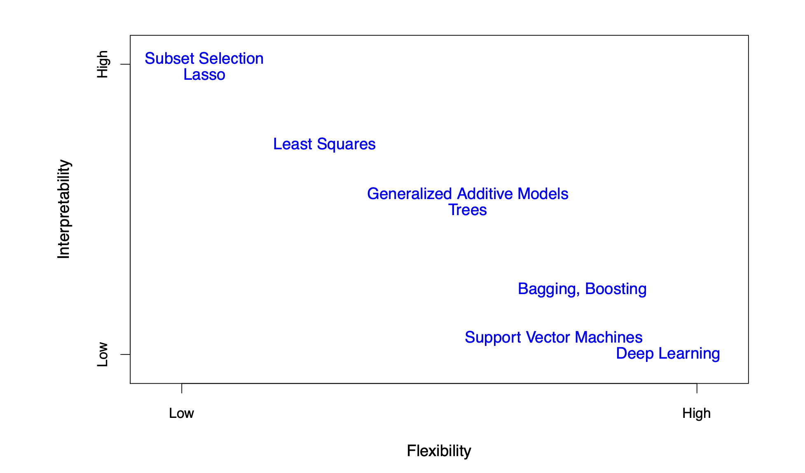

```{r setup, include=FALSE}
knitr::opts_chunk$set(echo = TRUE)
```

# Summary

Eight students submitted predictions for the Consumer Credit project.
All submitted the correct number of predictions (37,500 records). Two students
submitted multiple model variants (one with six models, another with two),
all of which are scored below.

This document summarizes the AUC scores for all submissions and includes an analysis
of the distribution of results. Student identities have been anonymized.

## Key Highlights

**Outstanding Class Performance:**
- The class top score of **0.8642** came within **99% of the original Kaggle competition winner** (0.8695)
- Top 5 students all scored above **0.84 AUC** — an impressive concentration of strong models
- The top 3 submissions were separated by only **0.003 AUC points** — extremely competitive!

**Model Diversity:**
- **XGBoost** emerged as the clear winner, achieving the highest AUC
- Multi-model submissions revealed significant algorithm differences (0.21 AUC spread)
- Students used R and Python; both languages produced top-tier results

{width=60%}

It is unsurprising that XGBoost claimed the top spot: as shown above, it sits on the **low interpretability / high flexibility** end of the spectrum, giving it the expressive power needed to capture complex, nonlinear relationships in credit risk data.

**Benchmarks for Context:**
- Random model: ~0.50 AUC
- In-class Age-only logistic model: ~0.64 AUC
- **Class mean (best per student): 0.8456**
- Original Kaggle winner: 0.8695 AUC

# Processing

```{r echo=FALSE, warning=FALSE, message=FALSE}
library(tidyverse)
library(pROC)

solutionfile      <- here::here('ConsumerCredit', 'solution.csv')
solution          <- read_csv(solutionfile, show_col_types = FALSE)
submissionsfolder <- here::here('ConsumerCredit', 'grading')

# Load all submissions
submissions <- tibble(
  file = list.files(path = submissionsfolder, pattern = '\\.csv$', recursive = FALSE)
) %>%
  mutate(
    csv  = map(file, ~ read_csv(file.path(submissionsfolder, .x), show_col_types = FALSE)),
    nrow = map_int(csv, nrow)
  )

# Score each submission (AUC against the solution, column 2)
getAUC <- function(csv, colnum = 2) {
  if (nrow(csv) != nrow(solution)) return(0)
  rocobj <- roc(
    response  = solution$SeriousDlqin2yrs,
    predictor = pull(csv[, colnum]),
    quiet     = TRUE
  )
  as.numeric(auc(rocobj))
}

submissions <- submissions %>%
  mutate(AUC = map_dbl(csv, getAUC))

# Anonymous label mapping — real names are kept private
# Student A = 6-model submitter (Weed)
# Student B = 2-model submitter (You)
# Students C/D/E/F/G/H = single-submission students (anonymized random order)
submissions <- submissions %>%
  mutate(
    label = case_when(
      str_detect(file, "MDMSub")              ~ "Professor McDonald",
      str_detect(file, "weed.*xgboost_final") ~ "Student A - XGBoost Final",
      str_detect(file, "weed.*xgboost\\.")    ~ "Student A - XGBoost",
      str_detect(file, "weed.*lasso_clean")   ~ "Student A - LASSO Clean",
      str_detect(file, "weed.*pca_lasso")     ~ "Student A - PCA LASSO",
      str_detect(file, "weed.*rf")            ~ "Student A - Random Forest",
      str_detect(file, "weed.*recipe4")       ~ "Student A - Recipe 4",
      str_detect(file, "you.*ensemble")       ~ "Student B - Ensemble",
      str_detect(file, "you.*logistic")       ~ "Student B - Logistic",
      str_detect(file, "abdellatif")          ~ "Student C",
      str_detect(file, "carattini")           ~ "Student D",
      str_detect(file, "du_yuming")           ~ "Student E",
      str_detect(file, "gubbala")             ~ "Student F",
      str_detect(file, "wang_zike")           ~ "Student G",
      str_detect(file, "koranteng")           ~ "Student H",
      TRUE ~ file
    )
  )

saveRDS(select(submissions, -csv), file = here::here('ConsumerCredit', 'submissions_2026.RDS'))
```

## Leaderboard

```{r}
submissions %>%
  select(label, AUC) %>%
  arrange(desc(AUC)) %>%
  mutate(AUC = round(AUC, 4))
```

## Distribution of Scores

```{r warning=FALSE}
ggplot(filter(submissions, AUC > 0), aes(x = AUC)) +
  geom_density(fill = "steelblue", alpha = 0.4) +
  geom_rug() +
  geom_vline(xintercept = 0.8695, linetype = "dashed", color = "red", linewidth = 0.8) +
  annotate("text", x = 0.8695, y = 0.5, label = "Kaggle Winner\n(0.8695)", 
           hjust = 1.1, color = "red", size = 3) +
  geom_vline(xintercept = 0.50, linetype = "dotted", color = "gray40", linewidth = 0.6) +
  annotate("text", x = 0.50, y = 1, label = "Random\n(0.50)", 
           hjust = -0.1, color = "gray40", size = 3) +
  labs(
    title = "Distribution of AUC Scores — FNCE 5352 Spring 2026",
    subtitle = "Class performance approached the Kaggle competition winner",
    x = "AUC",
    y = "Density"
  ) +
  theme_minimal()
```

## Performance Insights

```{r echo=FALSE}
# Calculate some statistics for display
best_auc <- max(submissions$AUC[submissions$AUC > 0])
mean_auc <- mean(submissions$AUC[submissions$AUC > 0 & !grepl("Professor|Student A -|Student B -", submissions$label)])
kaggle_winner <- 0.8695
pct_of_winner <- round(100 * best_auc / kaggle_winner, 1)

top5_threshold <- sort(unique(submissions$AUC[submissions$AUC > 0 & !grepl("Student A -|Student B -", submissions$label)]), decreasing = TRUE)[5]
```

**Class Statistics:**

- **Top Score:** `r round(best_auc, 4)` — **`r pct_of_winner`% of Kaggle winner!**
- **Mean Score (best per student):** `r round(mean_auc, 4)`
- **Top 5 students** all exceeded **`r round(top5_threshold, 2)` AUC**
- **Range:** `r round(min(submissions$AUC[submissions$AUC > 0]), 4)` to `r round(best_auc, 4)` (spread: `r round(best_auc - min(submissions$AUC[submissions$AUC > 0]), 2)`)

**What This Means:**

The class demonstrated strong mastery of predictive modeling. The top submission
came remarkably close to the Kaggle competition winner, which represents the
best model from thousands of global competitors. The tight clustering of top
scores indicates consistent high-quality work across multiple students.

The wide spread between best and worst models from Student A (0.65 to 0.86)
highlights a critical lesson: **algorithm selection and hyperparameter tuning
matter enormously**. XGBoost with proper tuning dramatically outperformed simpler
methods like PCA+LASSO.

# Student A — Model Comparison

One student submitted **six** model variants, demonstrating exceptional effort
and systematic model comparison. The results reveal important insights about
algorithm selection and hyperparameter tuning.

```{r}
student_a <- submissions %>%
  filter(str_detect(label, "^Student A")) %>%
  select(label, AUC) %>%
  arrange(desc(AUC)) %>%
  mutate(
    AUC  = round(AUC, 4),
    best = AUC == max(AUC)
  )

student_a

ggplot(student_a, aes(x = reorder(label, AUC), y = AUC, fill = best)) +
  geom_col() +
  geom_text(aes(label = AUC), hjust = -0.1, size = 3) +
  scale_fill_manual(values = c("FALSE" = "steelblue", "TRUE" = "darkorange"), guide = "none") +
  coord_flip() +
  ylim(0, max(student_a$AUC) * 1.1) +
  labs(
    title = "Student A — Model Comparison",
    subtitle = "XGBoost achieved highest AUC; 0.21 spread shows importance of algorithm choice",
    x = NULL, y = "AUC"
  ) +
  theme_minimal()
```

**Key Takeaway:** The 0.21 AUC spread (from 0.6534 to 0.8642) demonstrates that
**algorithm choice matters enormously** in credit modeling. XGBoost with proper
hyperparameter tuning dramatically outperformed simpler methods.

# Student B — Model Comparison

Another student submitted two model variants (ensemble and logistic regression),
both achieving excellent performance.

```{r}
student_b <- submissions %>%
  filter(str_detect(label, "^Student B")) %>%
  select(label, AUC) %>%
  arrange(desc(AUC)) %>%
  mutate(
    AUC  = round(AUC, 4),
    best = AUC == max(AUC)
  )

student_b

ggplot(student_b, aes(x = reorder(label, AUC), y = AUC, fill = best)) +
  geom_col() +
  geom_text(aes(label = AUC), hjust = -0.1, size = 3) +
  scale_fill_manual(values = c("FALSE" = "steelblue", "TRUE" = "darkorange"), guide = "none") +
  coord_flip() +
  ylim(0, max(student_b$AUC) * 1.05) +
  labs(
    title = "Student B — Model Comparison",
    subtitle = "Both models achieved nearly identical strong performance",
    x = NULL, y = "AUC"
  ) +
  theme_minimal()
```

**Key Takeaway:** Both models scored within 0.0003 AUC of each other (0.8478 vs 0.8481).
This tight clustering suggests **well-tuned models with similar underlying predictive
power**, despite different algorithmic approaches.

# Notes

The data was taken from the Kaggle competition "Give Me Some Credit":
[https://www.kaggle.com/c/GiveMeSomeCredit](https://www.kaggle.com/c/GiveMeSomeCredit)

An AUC of 0.50 represents a completely random model. During class we built a simple
logistic model using only the `Age` column and achieved an AUC of approximately 63.8%.
The winning score in the original Kaggle competition was 0.8695.

The code Professor McDonald used to generate his results can be found at
[https://github.com/mattmcd71/fnce5352_spring2025/tree/main/ConsumerCredit](https://github.com/mattmcd71/fnce5352_spring2025/tree/main/ConsumerCredit).
