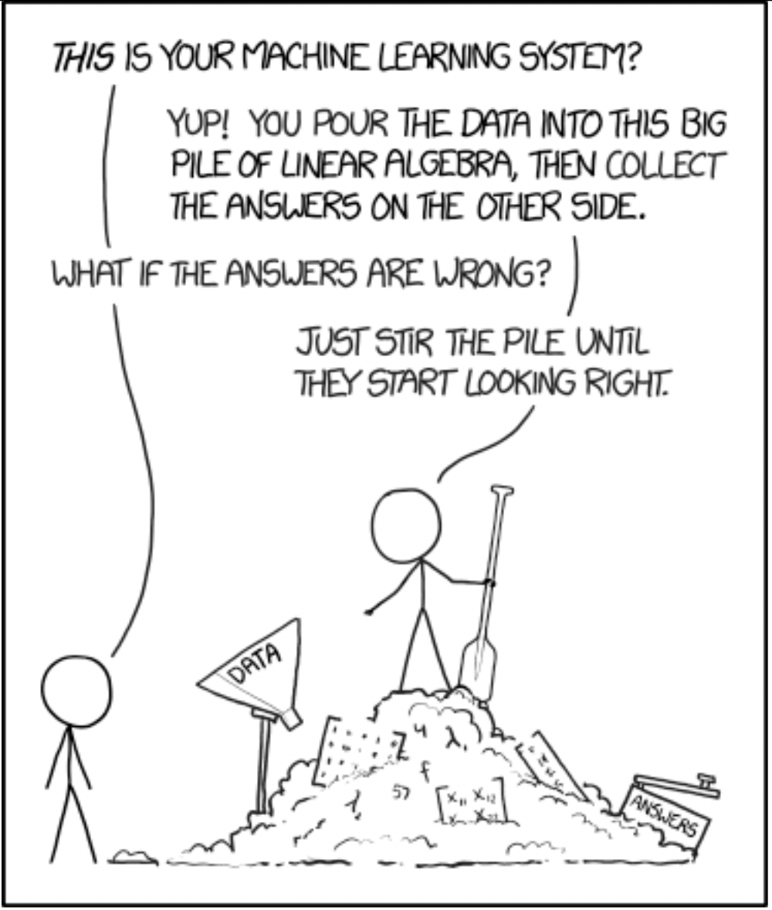
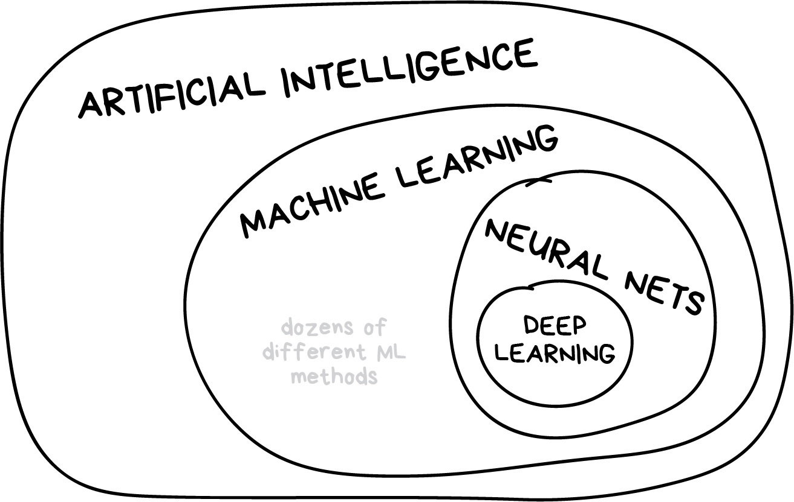
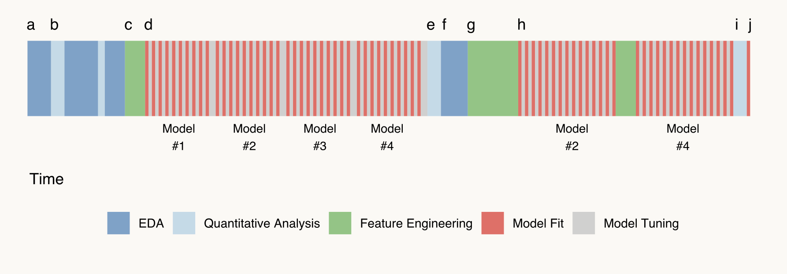

## What is machine learning?

{fig-align="center"}

::: footer
<https://xkcd.com/1838/>
:::

## What is machine learning?

{fig-align="center"}

::: footer
Illustration credit: <https://vas3k.com/blog/machine_learning/>
:::

## What is machine learning?

{fig-align="center"}

::: footer
Illustration credit: <https://vas3k.com/blog/machine_learning/>
:::

## Why R For Modeling? {.smaller}

::: columns
::: {.column width="50%"}
-   R has cutting edge models.

    -   Machine learning developers in some domains use R as their primary computing environment and their work often results in R packages.

-   R and R packages are built by people who do data analysis.

-   The S language is very mature.
:::

::: {.column width="50%"}
-   It is easy to port or link to other applications.

    -   R doesn't try to be everything to everyone. If you prefer models implemented in C, C++, tensorflow, keras, python, stan, or Weka, you can access these applications without leaving R.

-   The machine learning environment in R is extremely rich.
:::
:::

## Downsides to Modeling in R {.smaller}

::: columns

::: {.column width="50%"}
-   R is a data analysis language and is not C or Java. If a high performance deployment is required, R can be treated like a prototyping language.

-   R is mostly memory-bound. There are plenty of exceptions to this though.

:::

::: {.column width="50%"}
-   The main issue is one of consistency of interface. For example:

    -   There are two methods for specifying what terms are in a model1. Not all models have both.
    -   99% of model functions automatically generate dummy variables.
    -   Sparse matrices can be used (unless they can't).
:::

:::

## The Modeling Process {.smaller}

Common steps during model building are:

-   estimating model parameters (i.e. training models)

-   determining the values of tuning parameters that cannot be directly calculated from the data

-   model selection (within a model type) and model comparison (between types)

-   calculating the performance of the final model that will generalize to new data

Many books and courses portray predictive modeling as a short sprint. A better analogy would be a marathon or campaign (depending on how hard the problem is).

## What the Modeling Process Usually Looks Like

{fig-align="center"}

