## Tonight

- Linear regression as a *first* interpretable model
- Interpretation first, mechanics light
- Model assessment: *start the habits*

::: notes
House rules: Part 1 in R, assignments can be R or Python.
Tonight: build intuition + interpretation; no derivations.
:::

## Where we are

- Data workflow + returns (Lecture 1)
- Tidy data, EDA, transformation (Lectures 2–3)
- Prediction vs inference, overfitting, train/test (Earlier tonight)

::: notes
Bridge: now we put a simple model on top of the workflow.
:::

# Simple Linear Regression

## The model (one predictor)

$Y = \beta_0 + \beta_1 X + \varepsilon$

- slope = change in *expected* Y for +1 unit X
- intercept = expected Y when X = 0 (sometimes not meaningful)
- residual = what’s left

::: notes
Keep the language: expected / on average.
Units are the whole point.
:::

## Example 1: Advertising 

- outcome: **Sales**
- predictor: **TV** (ad spend)
- question: “How much does Sales change when TV spend increases?”

::: notes
Use this because it’s simple and the scatterplot is friendly.
No finance context needed yet.
:::

##
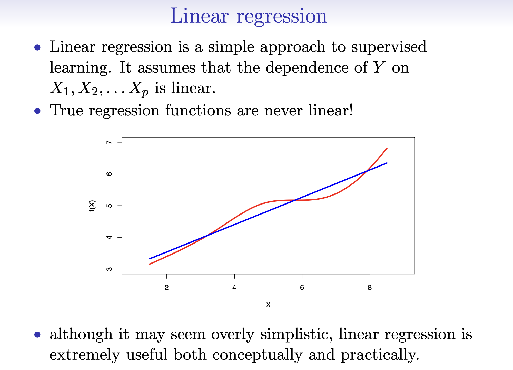

##
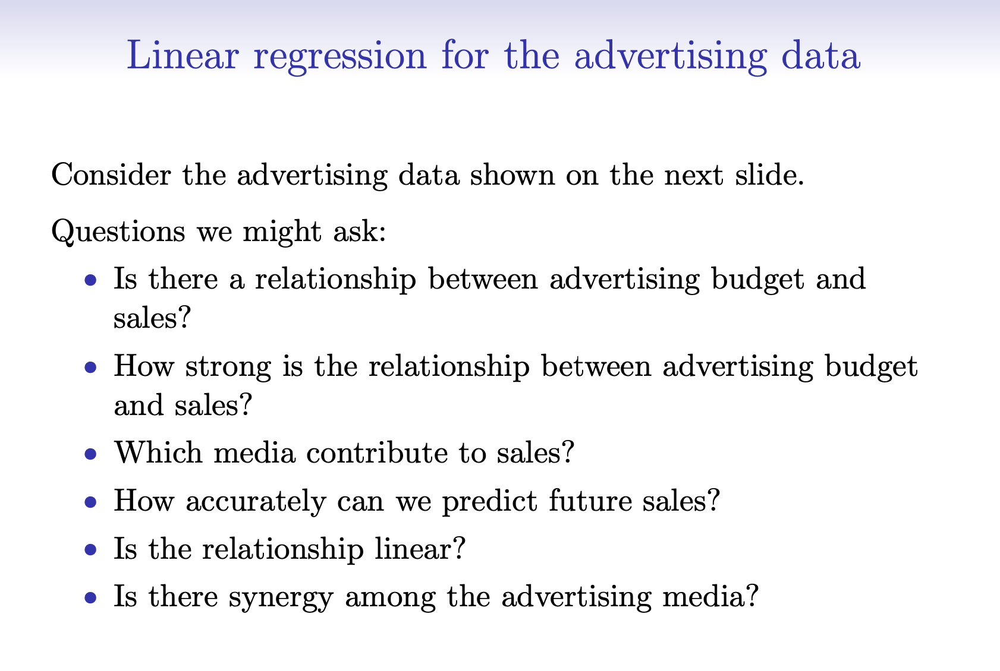

##
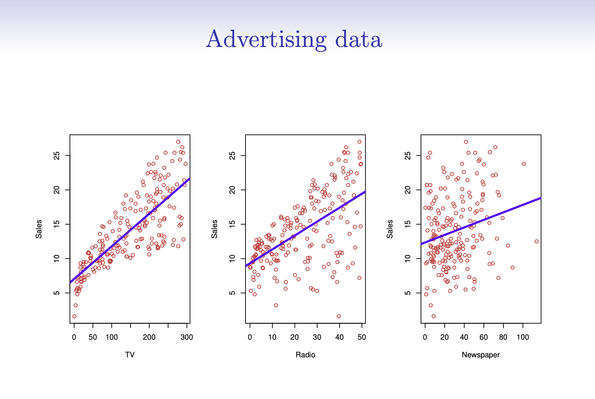

##
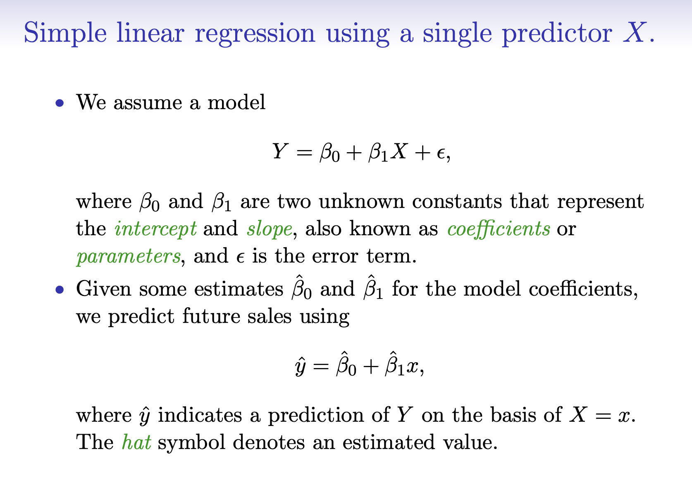

## Example 2: Market Model

$r_{AAPL,t} = \alpha + \beta\, r_{SPY,t} + \varepsilon_t$

- $\beta$: “market sensitivity” (beta)
- $\alpha$: “abnormal return” (in-sample; be humble)
- $\varepsilon$: idiosyncratic return (news / events / missing factors)

::: notes
Same model, finance meaning.
We’re not proving CAPM; we’re estimating an empirical relationship.
:::

## “Best line” idea

Regression chooses coefficients that make residuals “small” overall
(by minimizing squared errors).

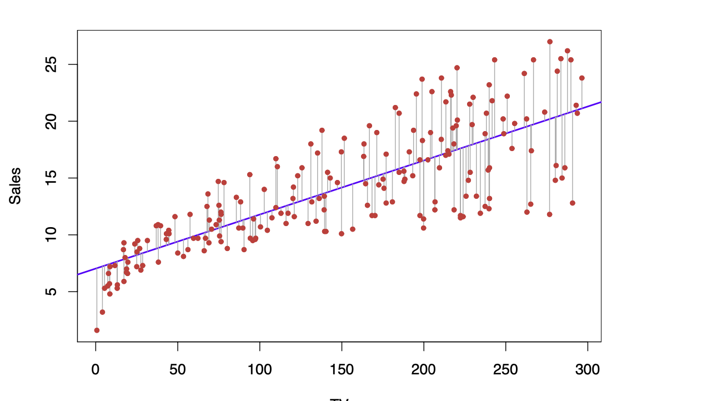

## What $\hat\beta_0$ and $\hat\beta_1$ represent

- chosen from the data
- depend on the scale/units of X and Y
- change if you add/remove variables

::: notes
This is the “estimates are not truths” moment.
We’ll read them from `summary(lm(...))` in the demo.
:::

## Interpreting a slope (always with units)

**Advertising:**
“+1 unit TV spend → expected Sales changes by $\hat\beta_1$ units”

**Finance:**
“+1% SPY return → expected AAPL return changes by $\hat\beta_1$% (same frequency)”

::: notes
Expected then realized.
Also: returns frequency (daily vs weekly) matters.
:::

## Quick check-in (1–2 minutes)

If $\beta = 1.20$, then:

> “When SPY is up 1%, the model expects AAPL to be up about ___% (on average).”

::: notes
Answer: ~1.2%. Emphasize “on average” and “in-sample.”
:::

# Accuracy of coefficients

## Coefficients come with uncertainty

We usually look at:

- standard errors (SE)
- confidence intervals (CI)
- t-stat / p-value (conceptual: “is slope plausibly 0?”)

::: notes
No deep theory—just: estimates vary due to noise.
CI is often easier to interpret than p-values.
:::

##
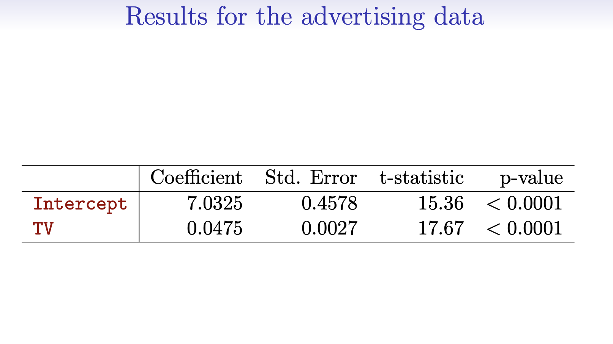

# Accuracy of the model

## Model accuracy (big picture)

Two different questions:

1. **In-sample fit:** did we explain anything?
2. **Generalization:** does it work on new data? (after break)

::: notes
Tie back to Lecture 3: generalization is the game.
:::

## RSE, RMSE, and \(R^2\)

- **RMSE**: typical error size (units of Y)
- **RSE**: regression “typical error” (close cousin to RMSE)
- **$R^2$**: fraction of variance explained (in-sample)

##
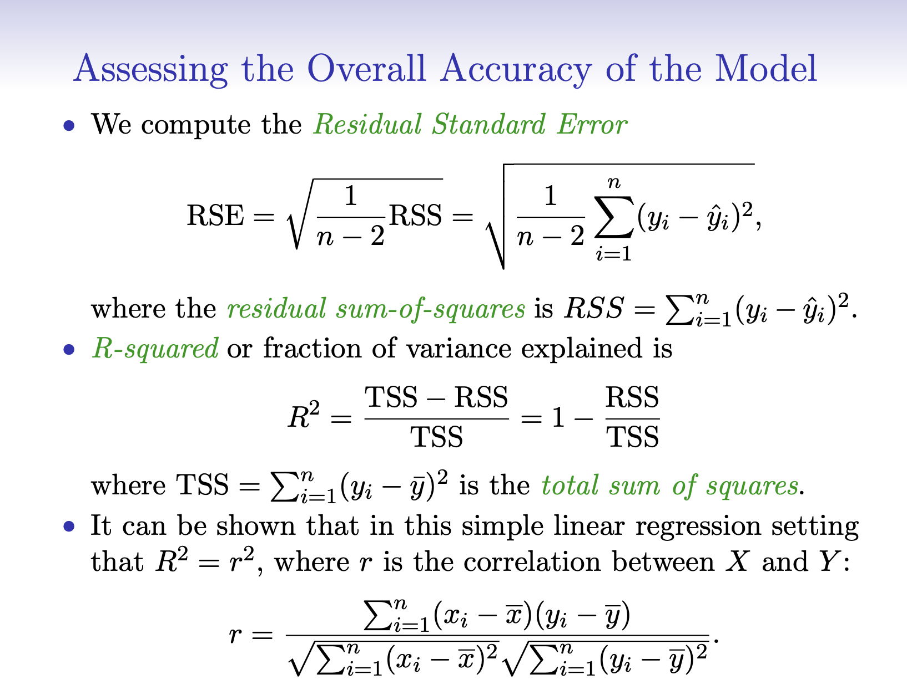

##
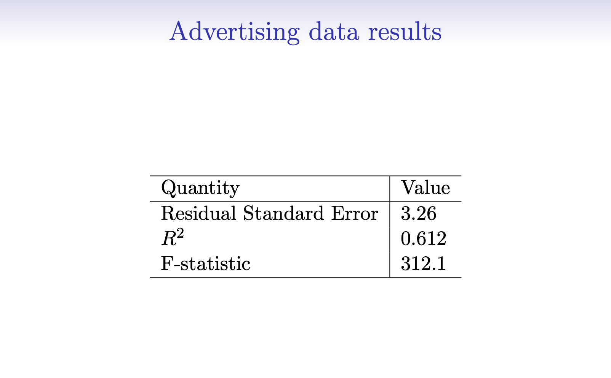

::: notes
Keep it pragmatic.
In finance, R² can be low and still useful (beta estimation).
:::

# Multiple linear regression

## Multiple regression = same idea, more X’s

$Y = \beta_0 + \beta_1 X_1 + \beta_2 X_2 + \cdots + \varepsilon$

Key phrase:

> “Holding other variables constant”

::: notes
This is where interpretation gets harder—and more useful.
:::

## Advertising: add more channels

$Sales = \beta_0 + \beta_{TV} TV + \beta_{Radio} Radio + \beta_{News} Newspaper + \varepsilon$

- Each slope is a *partial* relationship
- “TV effect, controlling for Radio and Newspaper”

::: notes
This is the cleanest “holding constant” example.
:::

## Finance: add volatility context (VIX)

$r_{AAPL,t} = \alpha + \beta_m r_{SPY,t} + \beta_v\,\Delta VIX_t + \varepsilon_t$

- $\beta_m$: market sensitivity *controlling for VIX moves*
- $\beta_v$: return response to volatility changes *holding market fixed*

::: notes
VIX is a stress proxy.
This model is not “truth,” it’s a structured approximation.
:::

## Interpreting coefficients (the catch)

- Works cleanly when predictors aren’t strongly correlated
- When predictors move together, coefficient “stories” get slippery

::: notes
This is the key conceptual pitfall.
In finance, factors are correlated; be humble about causal claims.
:::

##
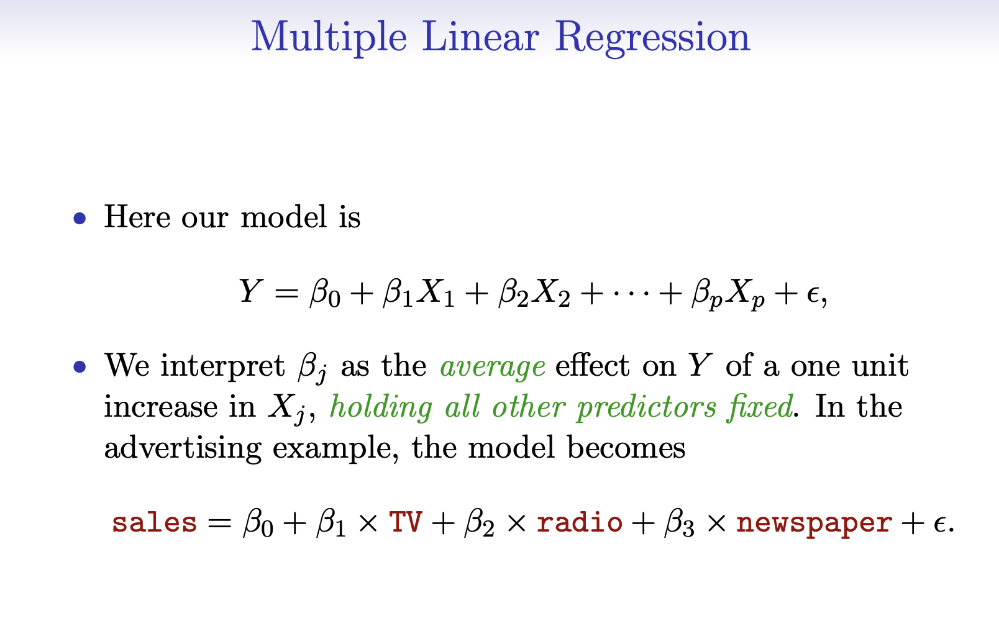

##
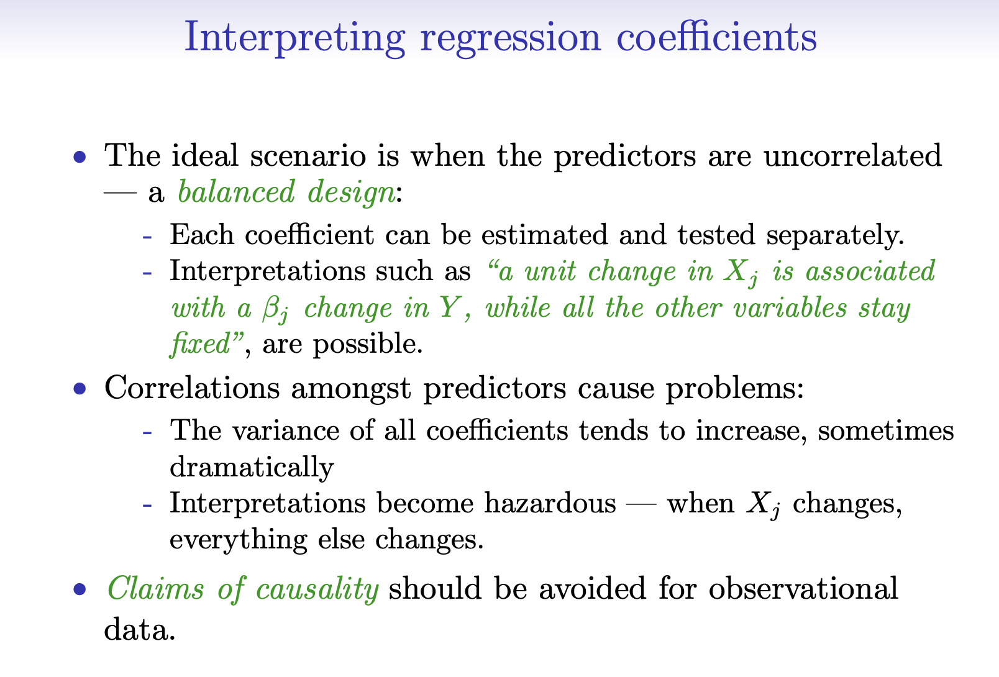

##
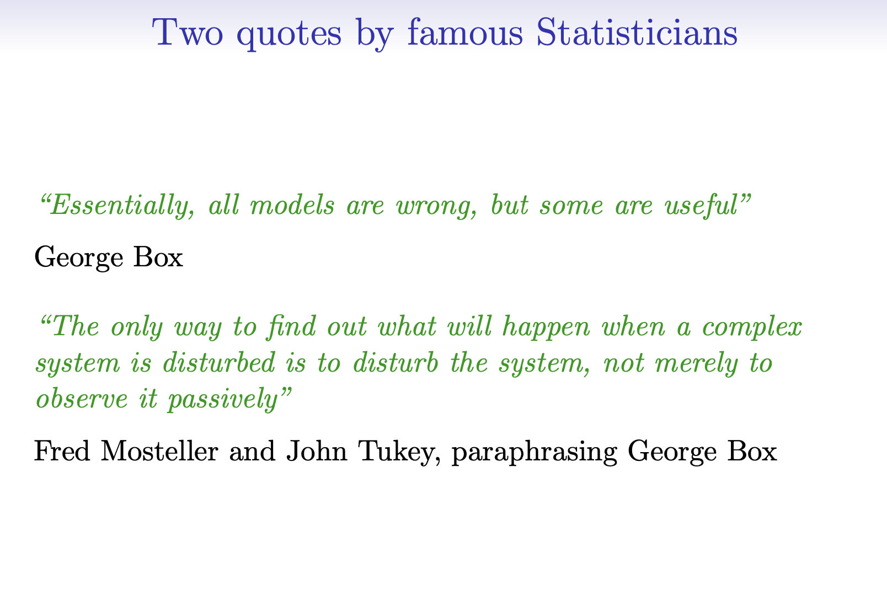

##
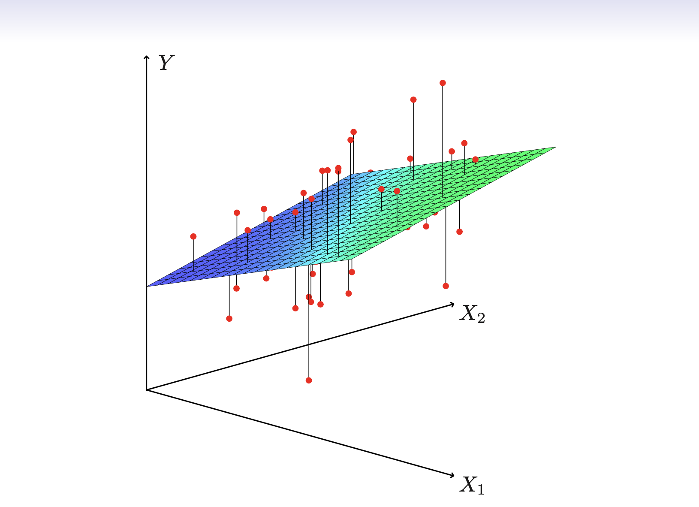

##
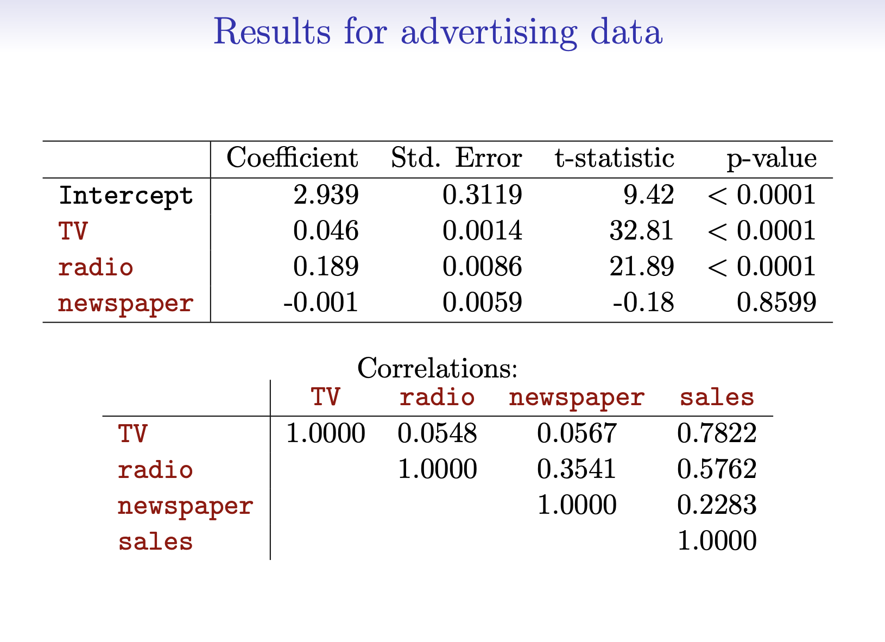

##
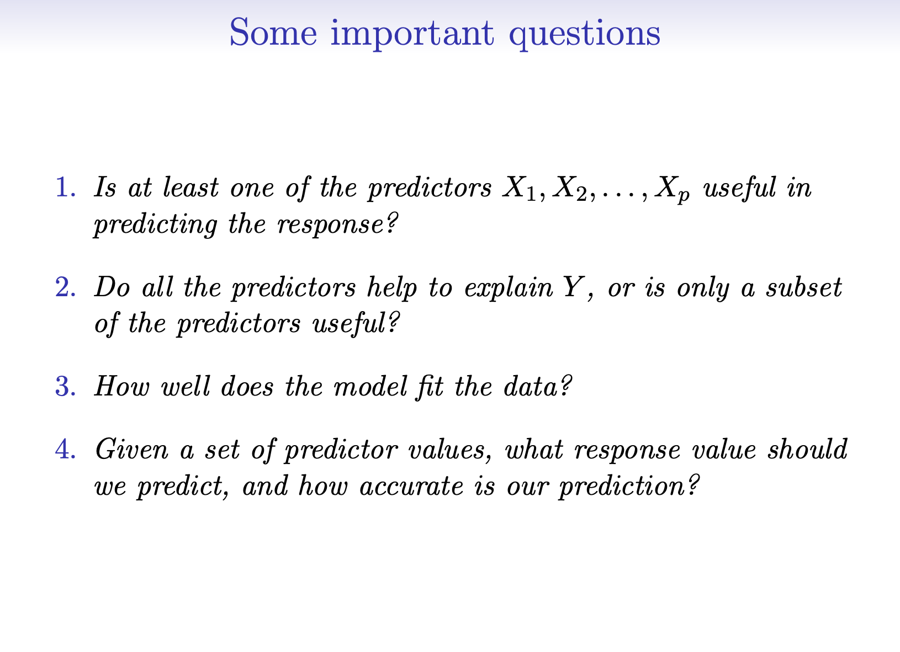

##
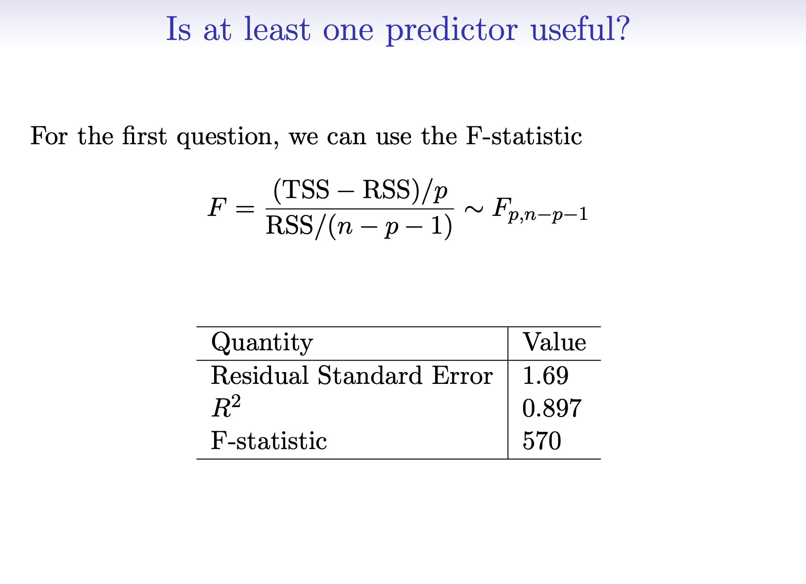

## What we’ll do interactively (after break)

- Advertising: simple → multiple regression
- AAPL/SPY: market model beta estimate
- Add VIX: multiple regression interpretation
- Metrics: RMSE/MSE/$R^2$ (including `yardstick`)

::: notes
The live demo is where the code lives.
Slides stay minimalist.
:::

## Break

15 minutes

::: notes
Before break: have them open RStudio + repo, pull latest, open the demo script.
If needed: install ISLR2 + yardstick.
:::
