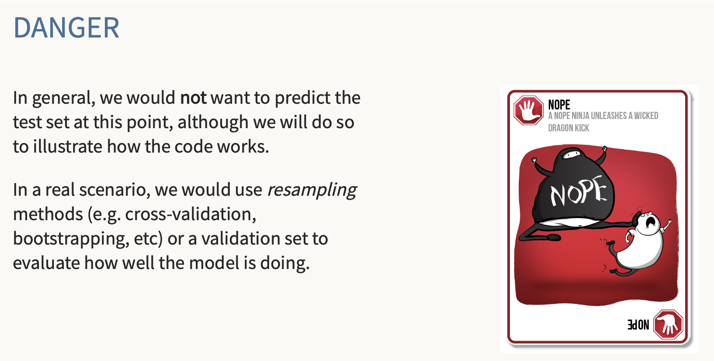
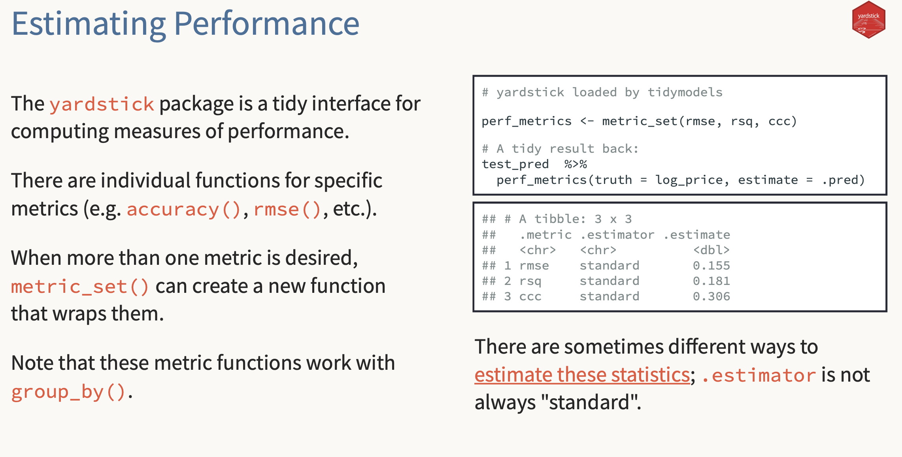
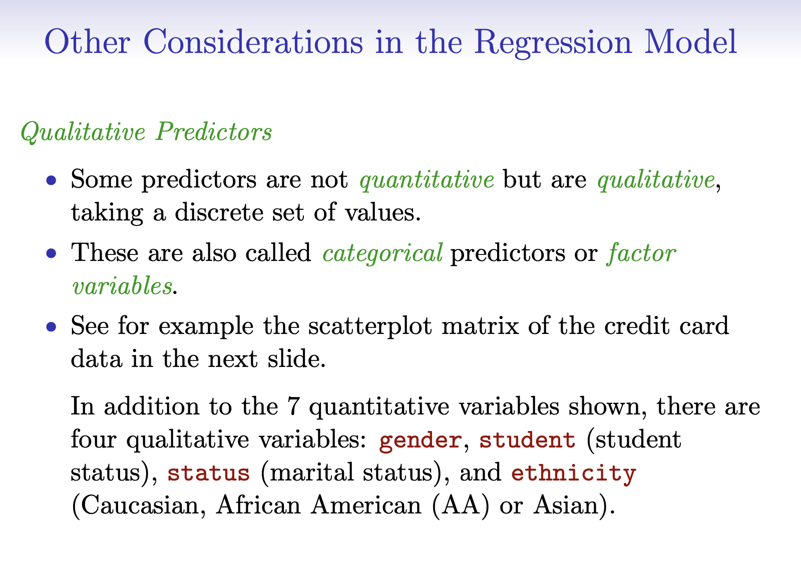
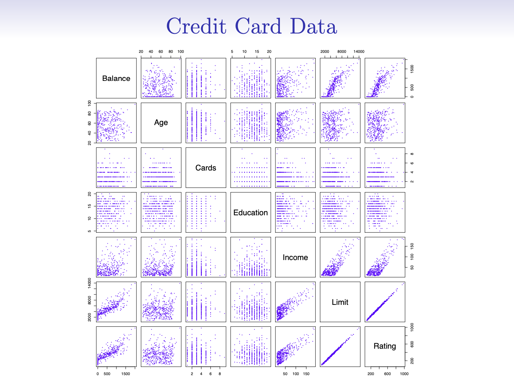
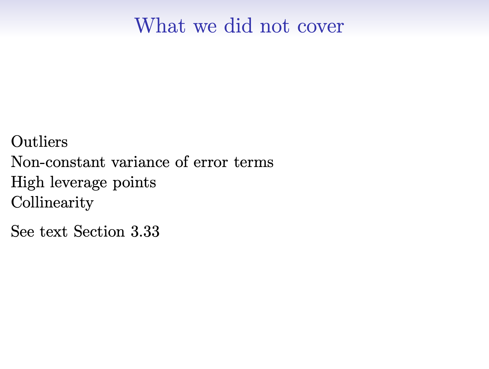
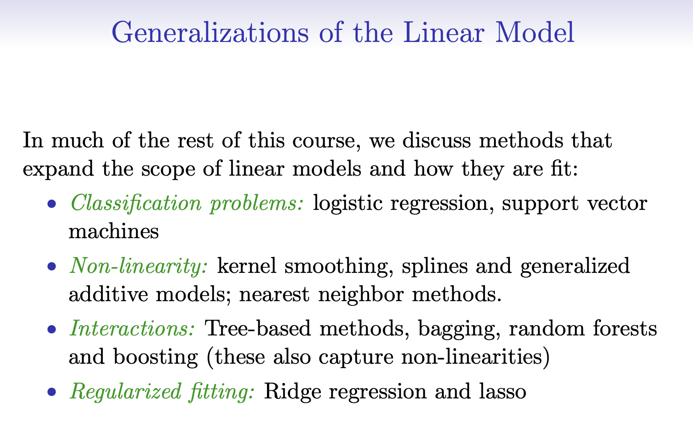

## Where Are We?

We now have working examples of:

- Simple regression (Advertising, AAPL ~ SPY)
- Multiple regression (+ predictors, “holding other vars constant”)
- Performance metrics (RMSE / MSE / R²), incl. `yardstick`

::: notes
Reset: we’ve *done* it. Now we focus on: when to trust it, what can go wrong,
and what to look at before you believe the story.
This aligns to ISLR Ch. 3: “Important questions” + “Other considerations”.
:::

# Important questions (ISLR Ch. 3)

## The “important questions” checklist

Even when the output looks clean:

- Is the relationship linear?
- Are residuals “well-behaved”?
- Are there outliers or high-leverage points?
- Are predictors correlated (collinearity)?
- Are we evaluating fairly (no peeking)?

::: notes
This is a modeling habit list.
We’re not deriving formulas—just building instinct for what to check.
:::

## Linear model assumptions (in English)

A linear model is most useful when:

- the mean relationship is roughly linear
- residuals don’t have obvious structure
- noise is roughly stable across the range (often false in finance)
- individual observations aren’t dominating the fit

::: notes
Keep it conceptual. Emphasize “useful approximation,” not “truth.”
:::

## Residual plots: what we look for

Residuals vs fitted values:

- random scatter around 0 (good)
- curve pattern (missing nonlinearity)
- funnel / changing spread (heteroskedasticity)
- a few huge residuals (outliers / events)

::: notes
This is the first diagnostic habit.
Connect to finance: volatility clusters create changing spread.
:::

## Finance translation

If residuals show patterns, possible stories:

- regime shifts / volatility clustering
- missing risk factor exposure
- nonlinear exposure (beta changes in stress)
- event days (earnings, macro surprises)

::: notes
Make it feel “finance-first”: the plot tells you where the model is blind.
:::

## Don’t tune on the test set

- Keep a test set you look at *once* (or rarely)
- Use train/validation (or resampling) for model choices
- In finance: **time split** → the future is the test

::: notes
Say “if you keep checking the test set while you tweak, you’re cheating.”
You can mention “data leakage” without getting technical.
:::

## 

## Performance metrics: what they are (and what they aren’t)

- **RMSE**: typical size of prediction error (units of Y)
- **MSE**: same, but squared units (penalizes large errors)
- **R²**: variance explained (always specify in-sample vs out-of-sample)

::: notes
RMSE is usually most interpretable.
R² is not “truth,” not “causal,” not “guaranteed to generalize.”
:::

## Yardstick as a metrics calculator

Why `yardstick` is handy (even using base `lm()`):

- consistent definitions (no copy/paste metric bugs)
- clean “truth vs estimate” interface
- works nicely with tibbles

##

::: notes
Important framing: we’re *not* adopting a tidymodels workflow tonight.
We’re borrowing a good metrics library.
:::

# Other considerations

## Correlated predictors (collinearity)

When X’s move together:

- coefficients can swing a lot with small data changes
- “holding other vars constant” becomes fragile
- prediction can still be OK even if interpretation is unstable

::: notes
Key interpretability point for multiple regression.
Tie back to SPY + VIX: they can be related in stress periods.
:::

## Outliers and leverage (conceptual)

- an outlier in Y: big residual (may not move the line much)
- a high-leverage point: unusual X (can move the line a lot)
- finance: single days can dominate if you let them

::: notes
Refer to “event days.” No need for Cook’s distance; just the intuition.
:::

## Qualitative predictors (categorical X)

- `lm()` turns factors into indicator (dummy) variables
- coefficients are differences vs a baseline level
- interpretation: “difference holding other vars fixed”

::: notes
Touch briefly. Tell students to read Ch. 3.
If you want a 2-minute demo later: add day-of-week as a factor.
:::

## 

##

## Interactions and nonlinearity 

- interactions: the effect depends on another variable (X₁ × X₂)
- nonlinearity: transforms or richer models
- we’ll revisit when we build features intentionally

::: notes
Keep to ~60–90 seconds and move on. Direct them to the chapter reading.

- We covered the workflow for simple + multiple regression
- We focused on interpretation + assessment habits
- Read ISLR Ch. 3 for categorical predictors + interactions + extensions
:::

## 

##

## Lightweight assignment (pick one)

1. **Market model memo (short):**
   - Fit AAPL ~ SPY (and one more ticker)
   - Interpret β in units + one residual diagnostic observation

2. **Generalization check (short):**
   - Time split train/test
   - Report RMSE + out-of-sample R² + 2–3 sentence takeaway

::: notes
Keep grading light: rubric 0–3 for clarity + correct units. Accept R or Python.
:::

## Final takeaway

- Interpret coefficients in units
- Multiple regression = “holding constant” (with caveats)
- Model assessment = habits (plots + fair evaluation)

