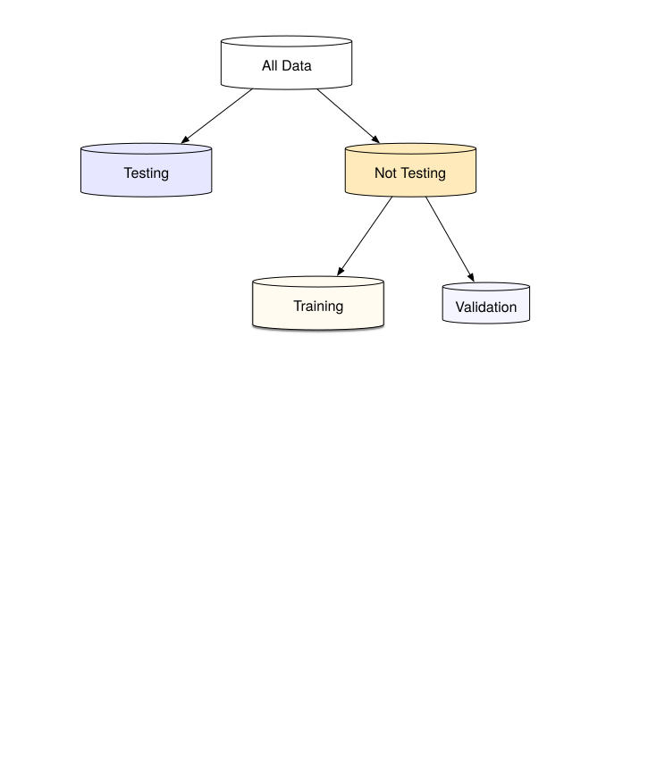
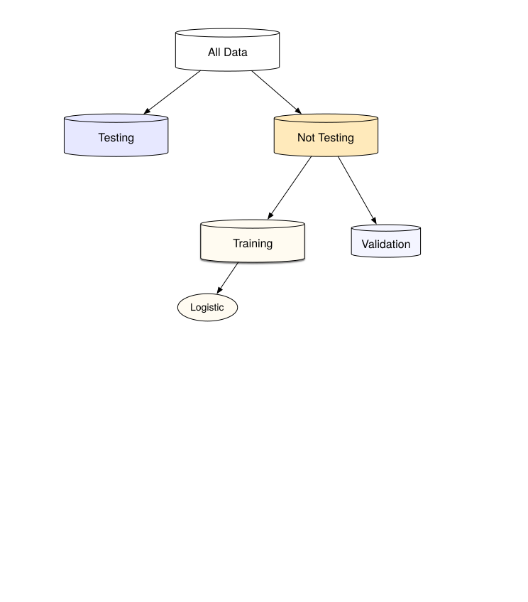
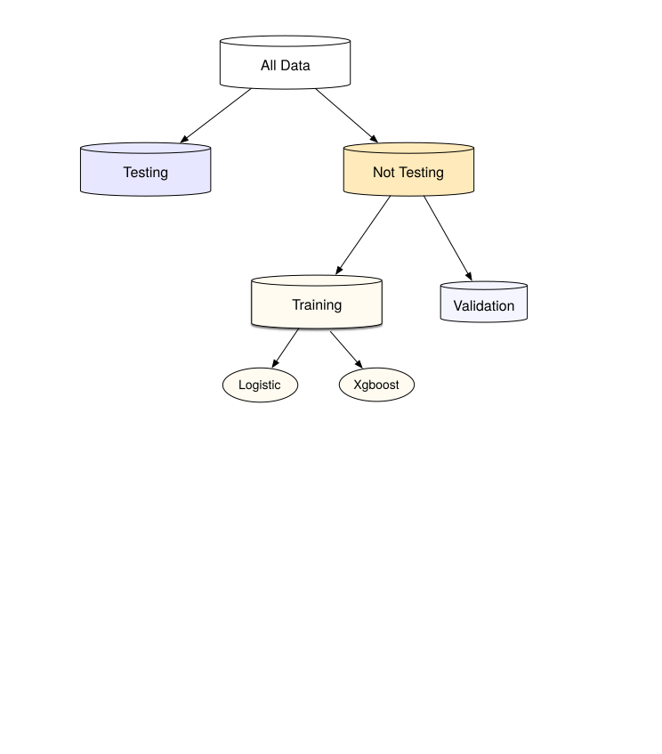
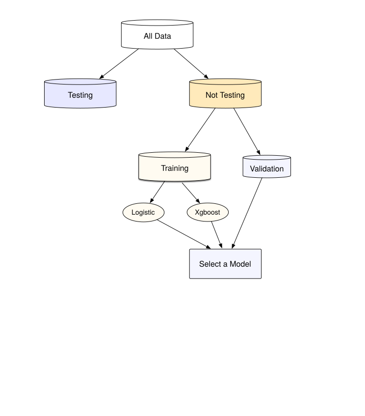
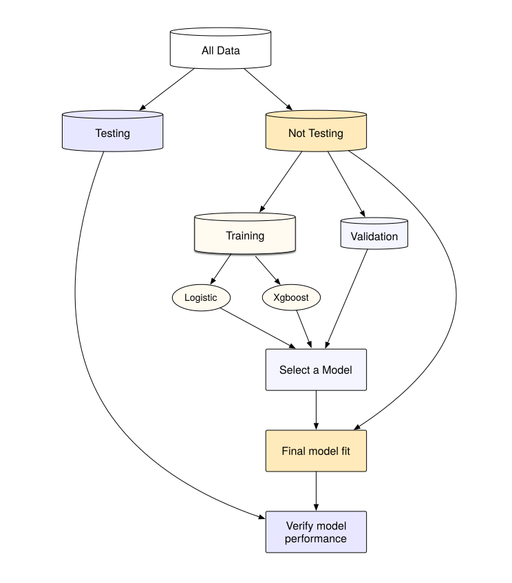

```{r}
#| echo: false
library(tidymodels)
tidymodels_prefer()

source("ames_snippets.R")
```


## Data splitting and spending

For machine learning, we typically split data into training and test sets:

. . .

-   The **training set** is used to estimate model parameters.
-   The **test set** is used to find an independent assessment of model performance.

. . .

Do not 🚫 use the test set during training.


## Data spending

{fig-align="center"}

## A first model

{fig-align="center"}

## Try another model

{fig-align="center"}

## Choose wisely...



## Finalize and verify {.annotation}

{fig-align="center"}

## ... and so on

Once we find an acceptable model and feature set, the process is to

-   Confirm our results on the test set.
-   Document the data and model development process.
-   Deploy, monitor, etc.


## Data splitting and spending

-   Spending too much data in **training** prevents us from computing a good assessment of predictive **performance**.

. . .

-   Spending too much data in **testing** prevents us from computing a good estimate of model **parameters**.


## How Do We Split THe Data?

```{r}
library(tidymodels)
tidymodels_prefer()

# Set the random number stream using `set.seed()` so that the results
# can be reproduced later. 
set.seed(501)

# Save the split information for an 80/20 split of the data
ames_split <- initial_split(ames, prop = 0.80)
ames_split
```

## Getting the Resulting Dataframes 

```{r}
ames_train <- training(ames_split)
ames_test  <-  testing(ames_split)

dim(ames_train)
```

## Stratified Sampling {.smaller}

-   Simple random sampling is appropriate in many cases but there are exceptions. 
-   When there is a dramatic _class imbalance_ in classification problems, one class occurs much less frequently than another. 
-   Using a simple random sample may haphazardly allocate these infrequent samples disproportionately into the training or test set. 
-   To avoid this, _stratified sampling_ can be used. 
-   The training/test split is conducted separately within each class and then these subsamples are combined into the overall training and test set. 
-   For regression problems, the outcome data can be artificially binned into quartiles and then stratified sampling can be conducted four separate times. 

## Ames Sale Price 

```{r ames-sale-price, echo = FALSE}
#| fig.cap = "The distribution of the sale price (in log units) for the Ames housing data. The vertical lines indicate the quartiles of the data",
#| fig.alt = "The distribution of the sale price (in log units) for the Ames housing data. The vertical lines indicate the quartiles of the data."

sale_dens <- 
  density(ames$Sale_Price, n = 2^10) %>% 
  tidy() 
quartiles <- quantile(ames$Sale_Price, probs = c(1:3)/4)
quartiles <- tibble(prob = (1:3/4), value = unname(quartiles))
quartiles$y <- approx(sale_dens$x, sale_dens$y, xout = quartiles$value)$y

quart_plot <-
  ggplot(ames, aes(x = Sale_Price)) +
  geom_line(stat = "density") +
  geom_segment(data = quartiles,
               aes(x = value, xend = value, y = 0, yend = y),
               lty = 2) +
  labs(x = "Sale Price (log-10 USD)", y = NULL)
quart_plot
```

## Creating A Stratified Split

```{r ames-strata-split}
set.seed(502)
ames_split <- initial_split(ames, prop = 0.80, strata = Sale_Price)
ames_train <- training(ames_split)
ames_test  <-  testing(ames_split)

dim(ames_train)
```

## Resulting Distributions of Sale Price

::: columns
::: {.column width="50%"}

```{r}
#| echo: false
#| fig-width: 4
ames_train %>% 
  ggplot() +
  geom_density(aes(x=Sale_Price)) + 
  ggtitle('Training Dataset Sale Price Dist')
```
:::
::: {.column width="50%"}
```{r}
#| echo: false
#| fig-width: 4
ames_test %>% 
  ggplot() +
  geom_density(aes(x=Sale_Price)) +
  ggtitle('Testing Dataset Sale Price Dist')
```
:::
:::
