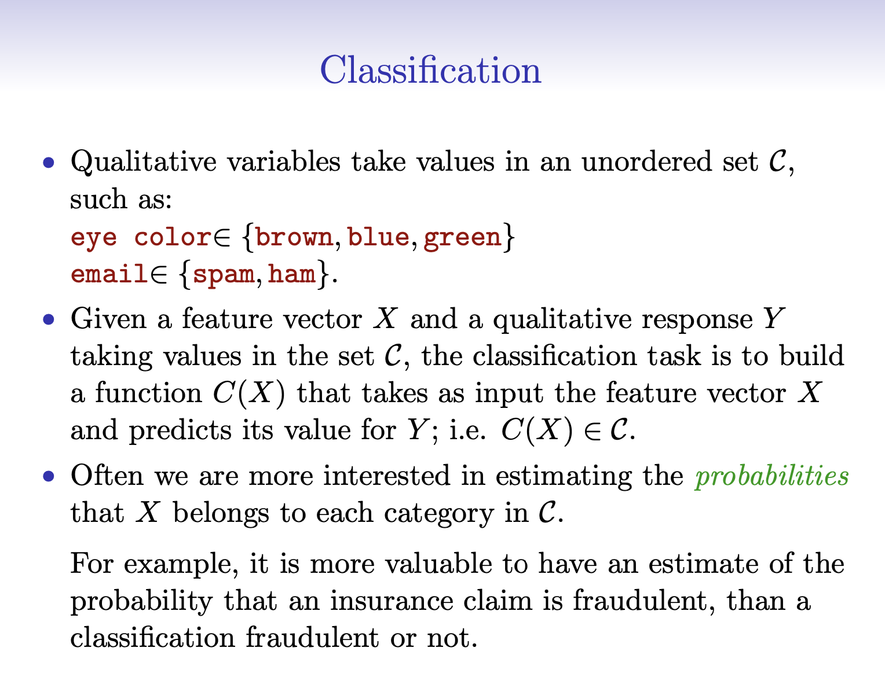
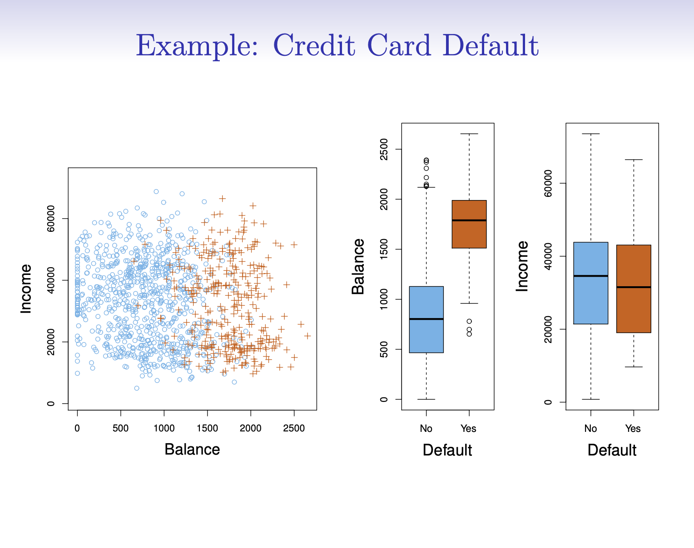
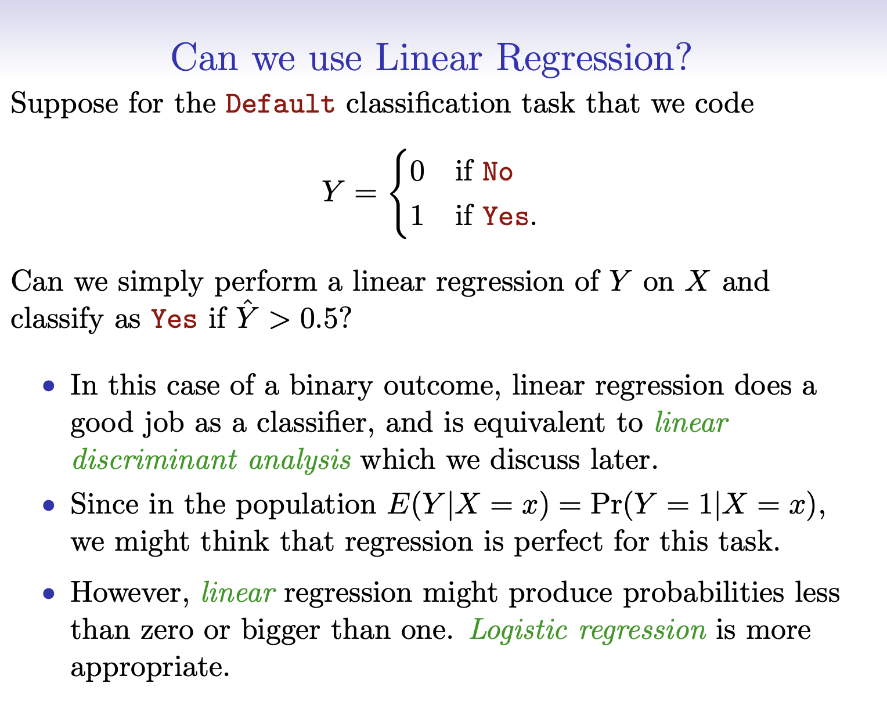
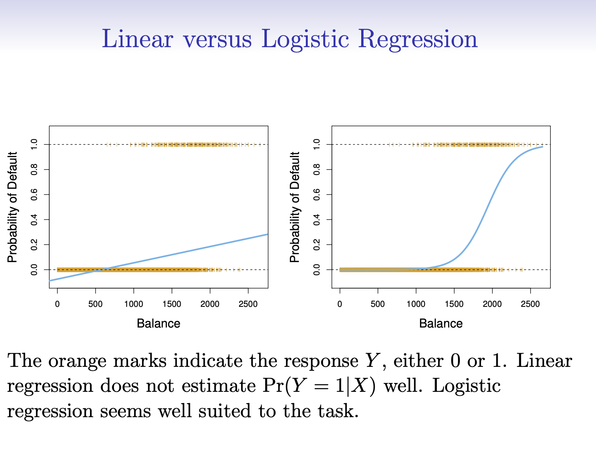

```{r}
#| include: false
#| file: setup.R
```

## Regression vs Classification {.smaller}

-   Definition:

    -   **Regression**: Predicts continuous outcomes. It estimates a mapping function (f) from input variables (X) to a continuous output variable (Y).

    -   **Classification**: Predicts discrete outcomes. It categorizes input data into two or more classes.

-   Output Type:

    -   **Regression**: The output is a real or continuous value (e.g., salary, price).

    -   **Classification**: The output is a category (e.g., default or no default).

-   Both regression and classification are types of supervised machine learning algorithms, where a model is trained according to the existing model along with correctly labeled data

## RMSE {.smaller}

-   Definition: The square root of the average of the squared differences between the predicted and actual values. It measures the standard deviation of the residuals (prediction errors).

-   Interpretation: Represents the average error made by the model in predicting the outcome. Lower values indicate better fit.

-   Scale: Depends on the target variable's scale. Higher RMSE values may not necessarily indicate a poor model, especially if the target variable has a wide range.

-   Sensitivity: More sensitive to outliers than other metrics, such as MAE (Mean Absolute Error).

## RMSE Formula

-   $\text{RMSE} = \sqrt{\frac{1}{n} \sum_{i=1}^{n} (y_i - \hat{y}_i)^2}$

-   $n$ is the number of observations.

-   $y_i$ is the actual value of the observation.

-   $\hat{y}_i$ is the predicted value.

-   The sum $\sum_{i=1}^{n} (y_i - \hat{y}_i)^2$ calculates the squared differences between the actual and predicted values.

## $R^2$ {.smaller}

-   Definition: The proportion of the variance in the dependent variable that is predictable from the independent variables. It is a statistical measure of how close the data are to the fitted regression line.

-   Interpretation: Values range from 0 to 1. A higher value indicates a better fit, with 1 meaning the model explains all the variability of the response data around its mean.

-   Scale-Independent: Unlike RMSE, R-squared is a normalized measure, making it easier to compare the goodness of fit across different datasets and models.

-   Limitation: Can be misleadingly high in models with many predictors or when using higher-order polynomials. Adjusted R-squared is often used to account for the number of predictors.

## $R^2$ Formula

-   $R^2 = 1 - \frac{\sum_{i=1}^{n} (y_i - \hat{y}_i)^2}{\sum_{i=1}^{n} (y_i - \bar{y})^2}$
-   $n$, $y_i$ and $\hat{y}_i$ are the defined the same as in $RMSE$
-   The numerator, $\sum_{i=1}^{n} (y_i - \hat{y}_i)^2$, is the sum of the squared differences between the actual and the predicted values (also known as the sum of squares of residuals).
-   The denominator, $\sum_{i=1}^{n} (y_i - \bar{y})^2$, is the total sum of squares (TSS) or the sum of the squared differences between the actual values and the mean of the actual values.

## RMSE vs $R^2$

$RMSE$ measures *accuracy* while $R^2$ measures *correlation*.

```{r performance-reg-metrics, echo = FALSE}
#| fig.cap = "Observed versus predicted values for models that are optimized using the RMSE compared to the coefficient of determination",
#| fig.alt = "Scatter plots of numeric observed versus predicted values for models that are optimized using the RMSE and the coefficient of determination. The former results in results that are close to the 45 degree line of identity while the latter shows results with a tight linear correlation but falls well off of the line of identity."
library(tidymodels)
library(kableExtra)
library(modeldata)
tidymodels_prefer()
source("ames_snippets.R")
load("RData/lm_fit.RData")

set.seed(234)
n <- 200
obs <- runif(n, min = 2, max = 20)

reg_ex <- 
  tibble(
    observed = c(obs, obs),
    predicted = c(obs + rnorm(n, sd = 1.5), 5 + .5 * obs + rnorm(n, sd = .5)),
    approach = rep(c("RMSE optimized", "R^2 optimized"), each = n)
  ) %>% 
  mutate(approach = factor(
    approach, 
    levels = c("RMSE optimized", "R^2 optimized"),
    labels = c(expression(RMSE ~ optimized), expression(italic(R^2) ~ optimized)))
  )

ggplot(reg_ex, aes(x = observed, y = predicted)) + 
  geom_abline(lty = 2) + 
  geom_point(alpha = 0.5) + 
  coord_obs_pred() + 
  facet_wrap(~ approach, labeller = "label_parsed")
```

## Calculating RMSE using yardstick

```{r}
#| echo: false
library(tidymodels)
library(countdown)
library(tidyverse)
data("tree_frogs", package = "stacks")
tree_frogs <- tree_frogs %>%
  mutate(t_o_d = factor(t_o_d),
         age = age / 86400) %>% 
  filter(!is.na(latency)) %>%
  select(-c(clutch, hatched))

set.seed(123)
frog_split <- initial_split(tree_frogs, prop = 0.8, strata = latency)
frog_train <- training(frog_split)
frog_test <- testing(frog_split)
tree_spec <- decision_tree(cost_complexity = 0.001, mode = "regression")
tree_wflow <- workflow(latency ~ ., tree_spec)
tree_fit <- fit(tree_wflow, frog_train)
data_with_predictions <- augment(tree_fit, new_data = frog_test)
```

```{r}
library (yardstick)

rmse(data_with_predictions, truth = latency, estimate = .pred)
```

## Calculating Multiple Metrics

```{r}
metrics <- metric_set(rmse, rsq, mae)
metrics(data_with_predictions, truth = latency, estimate = .pred)
```

. . .

-   RMSE: difference between the predicted and observed values ⬇️
-   $R^2$: squared correlation between the predicted and observed values ⬆️
-   MAE: similar to RMSE, but mean absolute error ⬇️


## 


## Classification: hard vs soft predictions

- **Soft prediction:** estimate a probability  
  - $\hat p(X) = P(Y=1 \mid X)$
- **Hard prediction:** turn that probability into a class label  
  - $\hat y(X) = \mathbf{1}\{\hat p(X) > t\}$ for some threshold $t$

::: notes
I want to make this explicit early:
- The model’s natural output is a probability (soft prediction).
- A hard label requires a threshold, which is a policy/decision choice.
Keep the math minimal: just p-hat and an indicator with threshold t.
:::

## Why soft predictions matter in credit risk

- We can **rank** accounts by risk (scorecards)
- We can choose different actions at different probability ranges  
  - e.g., approve / approve-with-conditions / manual review / decline
- Thresholds change when costs or objectives change

::: notes
Concrete credit examples:
- fraud: false negatives are expensive
- underwriting: false positives lose revenue / customer goodwill
Probability lets you adapt decisions without refitting the model.
:::

## Thresholds are business decisions

- Picking $t=0.50$ is **not** automatically “right”
- You pick $t$ based on tradeoffs:
  - false positive vs false negative costs
  - capacity constraints (manual reviews)
  - regulatory / policy constraints

::: notes
This tees up Part 2 (errors, varying threshold, ROC).
Say: “We’ll keep the model fixed and move the threshold knob.”
:::

## Example: credit card / default-style framing

- $Y=1$: “bad outcome” (fraud / default / delinquency / downgrade)
- $X$: features available at decision time (balance, utilization, income, behavior, etc.)
- Output: $\hat p = P(Y=1 \mid X)$

::: notes
Explicitly: We’re not building a production credit scorecard.
We’re learning modeling workflow + interpretation + evaluation.
:::

## 


## 


## 


## Why not just use linear regression?

- Linear regression can predict values < 0 or > 1
- The relationship between probability and predictors is rarely linear
- Classification wants a model constrained to $[0,1]$

::: notes
Keep it simple. The audience gets why “probabilities outside [0,1]” is bad.
Then: logistic fixes the range and gives an interpretable probability curve.
:::

## Linear vs logistic (big idea)

- Logistic regression models probability using an S-shaped curve
- Think: “linear model on log-odds”

$$
\log\left(\frac{p(X)}{1-p(X)}\right) = \beta_0 + \beta_1 X_1 + \cdots + \beta_p X_p
$$

::: notes
One equation is enough. I usually read it as:
- left side = log-odds
- right side = familiar linear predictor
We’ll fit it with glm and interpret directionally.
:::


## Fitting logistic regression in R 

Small snippet only — we’ll do the real work in the `.R` demo file.

```r
fit <- glm(default ~ balance + income + student,
           data = train,
           family = binomial)

p_hat <- predict(fit, newdata = test, type = "response")
```

::: notes
Emphasize: glm is “generalized linear model”; binomial family = logistic regression.
type="response" gives probability (not log-odds).
:::

## Interpreting coefficients 

- Sign: increases vs decreases risk
- Magnitude: relates to odds, not raw probability
- Optional: odds ratio for a 1-unit increase in $X_j$ is $\exp(\beta_j)$

::: notes
Don’t overdo this. Students struggle if we get too deep into odds.
I like to say: “positive coefficient => higher risk holding other vars fixed.”
Then optional: exp(beta) as multiplicative change in odds.
:::

## Prediction = probability, not a decision

- Model output: $\hat p_i = P(Y_i=1 \mid X_i)$
- Decision rule needs a threshold $t$:
  - predict 1 if $\hat p_i > t$

::: notes
This slide sets up Part 2: errors, thresholds, ROC.
Make the point: classification model gives probabilities; you choose a policy.
:::

## Part 1 wrap

You should be able to:

- explain why logistic regression is used for $0/1$ outcomes
- fit a simple logistic regression with `glm()`
- generate predicted probabilities with `predict(..., type="response")`

Next (after break): how to evaluate + choose thresholds.

::: notes
Preview: Types of Errors, Varying the Threshold, ROC Curve.
:::
