## 
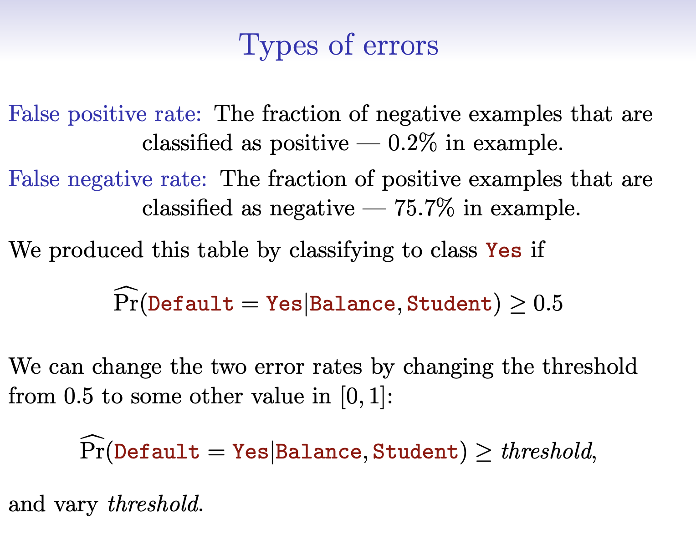

## Confusion matrix 

- Truth vs Prediction:
  - TP / FP / TN / FN
- From this we get:
  - Accuracy, sensitivity (recall), specificity, precision

::: notes
Don’t drown them in definitions. Just enough so the confusion matrix is usable.
Then show yardstick does the arithmetic.
:::

## 
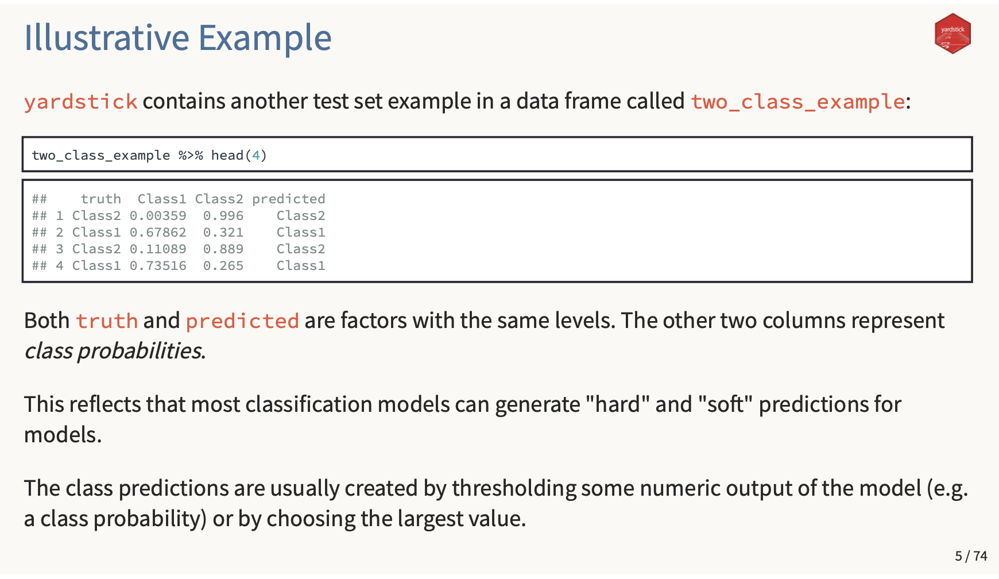

## 
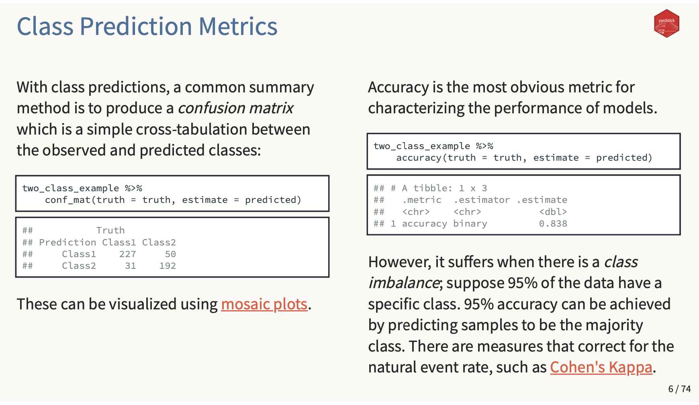

## 
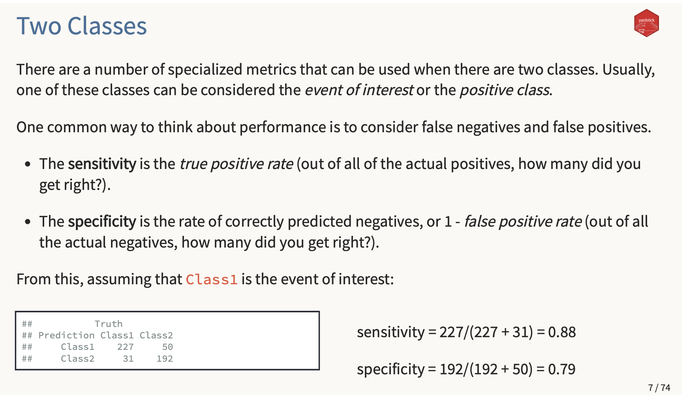

## 
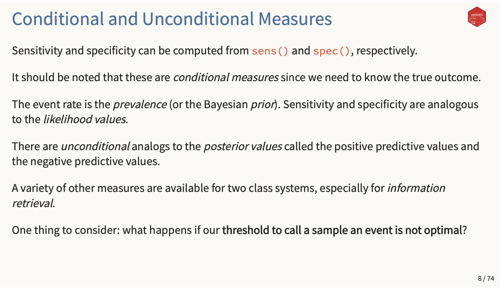

## 
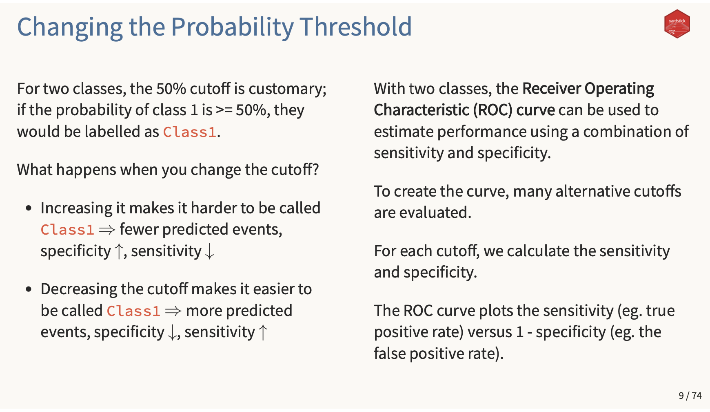

## ROC curve

- Summarizes performance across thresholds
- Plots: True Positive Rate vs False Positive Rate
- AUC: larger is better (in a broad sense)

::: notes
Say: ROC is threshold-free summary.
But: you still need a threshold for a decision.
:::

## 
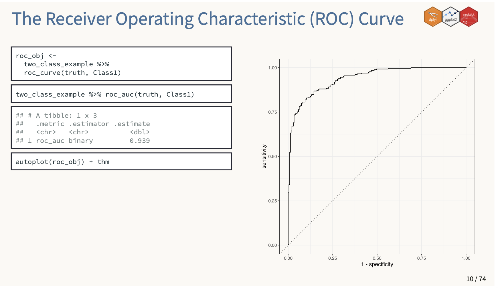

## Threshold is a policy choice

- Predict “Yes” if $\hat p > t$
- Raising $t$:
  - fewer predicted positives
  - usually fewer false positives, more false negatives

::: notes
This is the “knob” we can turn.
Then we show the slide that makes this concrete.
:::

## 
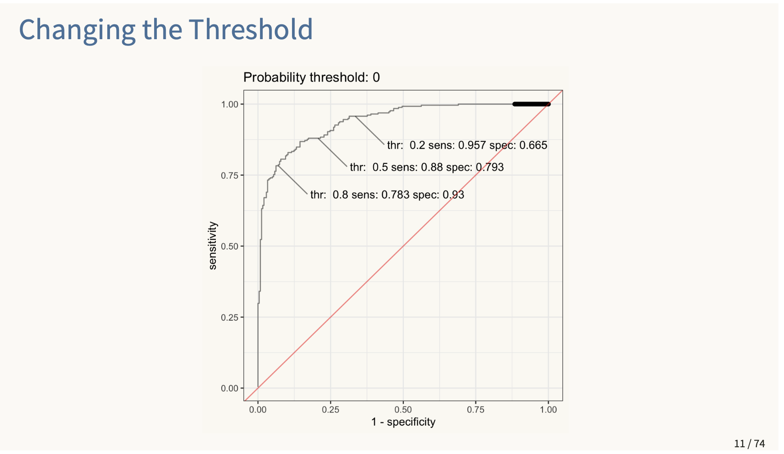

## 
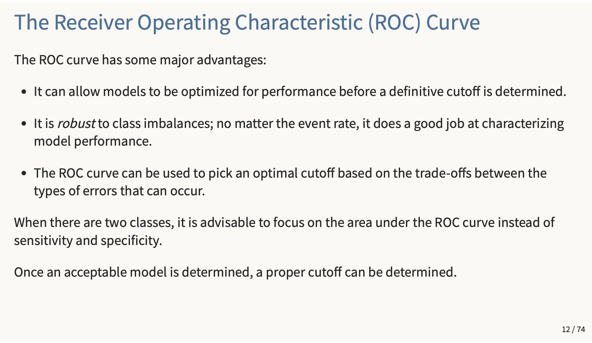

## Minimal R snippet (metrics calculator)

```r
# p_hat = predicted probabilities for event "Yes"
conf_mat(truth = default, estimate = pred)

accuracy(truth = default, estimate = pred)
sens(truth = default, estimate = pred)
spec(truth = default, estimate = pred)

roc_auc(truth = default, .pred_Yes = p_hat)
```

::: notes
Reinforce: model is glm; yardstick is just doing bookkeeping.
:::

# Live Coding

<!--
## Quick exercise (10–15 minutes)

In pairs (or on your own):

1. Fit logistic regression on `ISLR2::Default`
2. Score test probabilities $\hat p$
3. Compare two thresholds:
   - $t=0.50$
   - your chosen $t$ based on a cost story

Deliverable (in class): one sentence
- “We chose $t = \_\_ $ because false negatives are more costly than false positives (or vice versa).”

::: notes
They don’t need to be right; they need to articulate the tradeoff.
:::

## Wrap + bridge to Lectures 6 & 7

- Logistic regression gives probabilities $P(Y=1 \mid X)$
- Thresholds translate probabilities into decisions (with tradeoffs)
- ROC/AUC helps compare models across thresholds

Next:
- Lecture 6: honest model comparison via resampling / cross-validation (ISLR Ch. 5)
- Lecture 7: model selection + regularization (ISLR Ch. 6) and a taste of “beyond linearity” (ISLR Ch. 7)

::: notes
Make the roadmap explicit: Chapter 4 now; Chapter 5 next; then 6 and 7.
We will keep math light, focus on intuition + workflow.
:::
-->
## Classification toolkit (ISLR Ch. 4)

- **Logistic regression** (today’s workhorse): flexible + interpretable
- **LDA / QDA**: model class-conditional distributions, then apply Bayes
- **KNN**: “predict like your neighbors” (non-parametric)
- **Naive Bayes**: simple generative model with strong independence assumption

::: notes
This is the 10,000-foot map from ISLR Chapter 4.
Students should see there are multiple reasonable approaches; we’re focusing on logistic today.
Also sets up “generative vs discriminative” without going deep.
:::

## Two big families: discriminative vs generative

- **Discriminative:** model $P(Y \mid X)$ directly  
  - logistic regression
- **Generative:** model $P(X \mid Y)$ and $P(Y)$, then use Bayes’ rule  
  - LDA, QDA, Naive Bayes

::: notes
Key teaching line: generative methods model the data-generation per class,
then we “flip” to get probabilities of class given features.
No derivations; just the idea.
:::

##
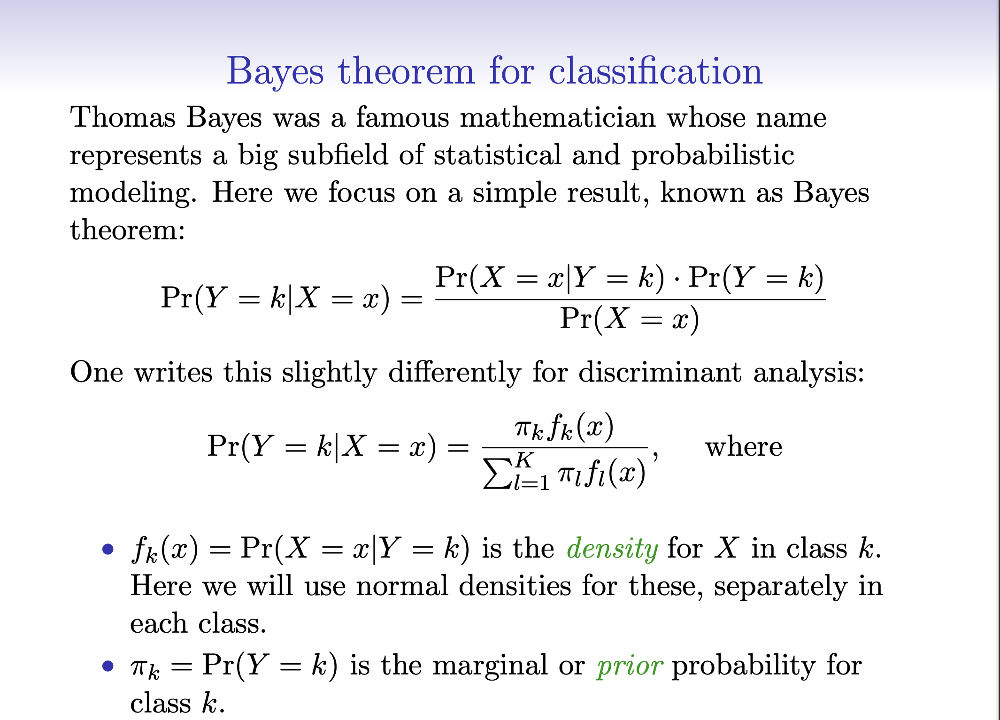

## LDA (Linear Discriminant Analysis)

- Assumes $X \mid Y=k$ is multivariate normal
- Assumes **shared covariance** across classes
- Leads to a **linear** decision boundary

::: notes
High-level:
- LDA can be great when assumptions are roughly true or data is limited.
- It’s a useful benchmark and a clean “generative” contrast to logistic.
:::

## 

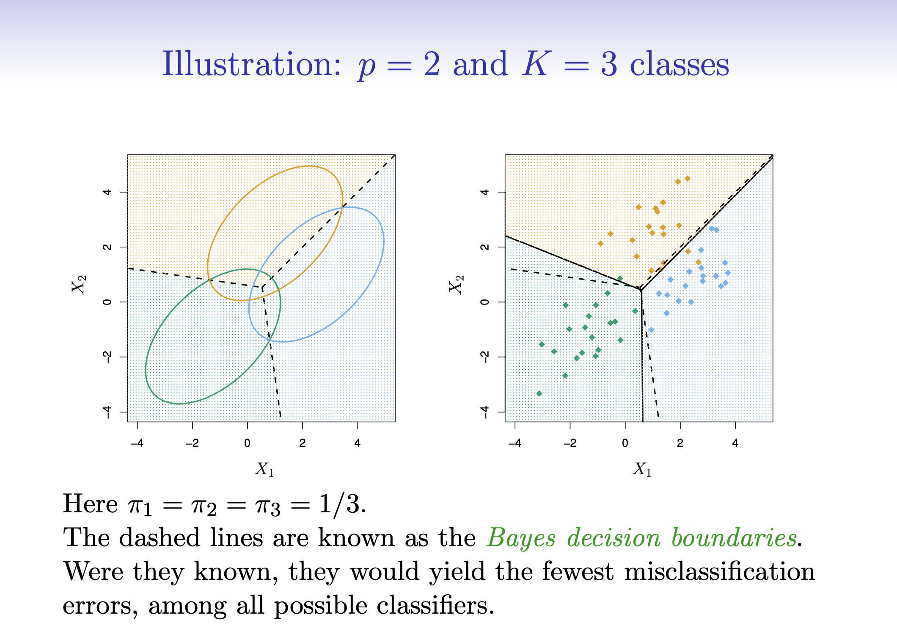

## QDA (Quadratic Discriminant Analysis)

- Same normality idea as LDA
- Allows **different covariance** per class
- More flexible → can overfit with limited data

::: notes
One-liner contrast: QDA is like “LDA with separate covariance per class.”
So it’s more flexible but higher variance.
Tie back to bias–variance from Lecture 3.
:::

## 
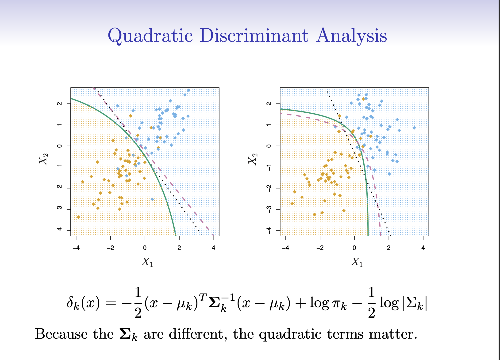


## KNN (k-nearest neighbors)

- No parametric form for $P(Y \mid X)$
- Predict based on labels of the $k$ nearest observations
- Key tuning knob: $k$ (small $k$ = flexible, large $k$ = smoother)

::: notes
Intuitive explanation:
- “Look at the neighborhood; vote.”
Main caveats:
- scaling matters, distance can get weird in high dimensions.
:::


## Naive Bayes

- Generative approach using Bayes’ rule
- Assumes features are **conditionally independent** given the class
- Often works well in high dimensions (e.g., text), decent baseline elsewhere

::: notes
The independence assumption is “naive” but can still yield good classifiers.
In tabular finance settings, often a baseline/benchmark rather than final model.
:::

## Summary: when might each show up?

- Logistic regression: default “first serious model”
- LDA/QDA: useful benchmarks; can be strong with small data / near-normal features
- KNN: intuitive, but sensitive to scaling and dimension
- Naive Bayes: fast baseline; works best when independence is “not too wrong”

::: notes
Keep this brief. The rest of the lecture stays on logistic + evaluation.
This section is just the mental map of Chapter 4.
:::