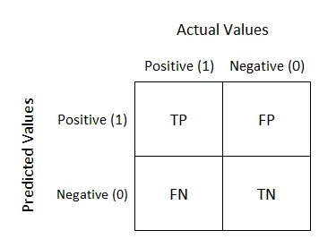
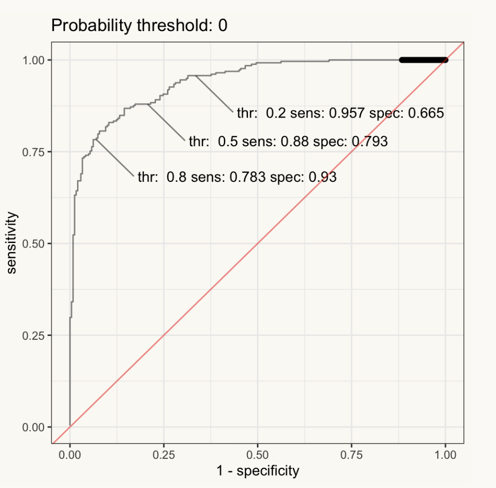

## 


```{r}
#| include: false
#| file: setup.R
```

## Regression vs Classification {.smaller}

-   Definition:

    -   **Regression**: Predicts continuous outcomes. It estimates a mapping function (f) from input variables (X) to a continuous output variable (Y).

    -   **Classification**: Predicts discrete outcomes. It categorizes input data into two or more classes.

-   Output Type:

    -   **Regression**: The output is a real or continuous value (e.g., salary, price).

    -   **Classification**: The output is a category (e.g., default or no default).

-   Both regression and classification are types of supervised machine learning algorithms, where a model is trained according to the existing model along with correctly labeled data

## RMSE {.smaller}

-   Definition: The square root of the average of the squared differences between the predicted and actual values. It measures the standard deviation of the residuals (prediction errors).

-   Interpretation: Represents the average error made by the model in predicting the outcome. Lower values indicate better fit.

-   Scale: Depends on the target variable's scale. Higher RMSE values may not necessarily indicate a poor model, especially if the target variable has a wide range.

-   Sensitivity: More sensitive to outliers than other metrics, such as MAE (Mean Absolute Error).

## RMSE Formula

-   $\text{RMSE} = \sqrt{\frac{1}{n} \sum_{i=1}^{n} (y_i - \hat{y}_i)^2}$

-   $n$ is the number of observations.

-   $y_i$ is the actual value of the observation.

-   $\hat{y}_i$ is the predicted value.

-   The sum $\sum_{i=1}^{n} (y_i - \hat{y}_i)^2$ calculates the squared differences between the actual and predicted values.

## $R^2$ {.smaller}

-   Definition: The proportion of the variance in the dependent variable that is predictable from the independent variables. It is a statistical measure of how close the data are to the fitted regression line.

-   Interpretation: Values range from 0 to 1. A higher value indicates a better fit, with 1 meaning the model explains all the variability of the response data around its mean.

-   Scale-Independent: Unlike RMSE, R-squared is a normalized measure, making it easier to compare the goodness of fit across different datasets and models.

-   Limitation: Can be misleadingly high in models with many predictors or when using higher-order polynomials. Adjusted R-squared is often used to account for the number of predictors.

## $R^2$ Formula

-   $R^2 = 1 - \frac{\sum_{i=1}^{n} (y_i - \hat{y}_i)^2}{\sum_{i=1}^{n} (y_i - \bar{y})^2}$
-   $n$, $y_i$ and $\hat{y}_i$ are the defined the same as in $RMSE$
-   The numerator, $\sum_{i=1}^{n} (y_i - \hat{y}_i)^2$, is the sum of the squared differences between the actual and the predicted values (also known as the sum of squares of residuals).
-   The denominator, $\sum_{i=1}^{n} (y_i - \bar{y})^2$, is the total sum of squares (TSS) or the sum of the squared differences between the actual values and the mean of the actual values.

## RMSE vs $R^2$

$RMSE$ measures *accuracy* while $R^2$ measures *correlation*.

```{r performance-reg-metrics, echo = FALSE}
#| fig.cap = "Observed versus predicted values for models that are optimized using the RMSE compared to the coefficient of determination",
#| fig.alt = "Scatter plots of numeric observed versus predicted values for models that are optimized using the RMSE and the coefficient of determination. The former results in results that are close to the 45 degree line of identity while the latter shows results with a tight linear correlation but falls well off of the line of identity."
library(tidymodels)
library(kableExtra)
library(modeldata)
tidymodels_prefer()
source("ames_snippets.R")
load("RData/lm_fit.RData")

set.seed(234)
n <- 200
obs <- runif(n, min = 2, max = 20)

reg_ex <- 
  tibble(
    observed = c(obs, obs),
    predicted = c(obs + rnorm(n, sd = 1.5), 5 + .5 * obs + rnorm(n, sd = .5)),
    approach = rep(c("RMSE optimized", "R^2 optimized"), each = n)
  ) %>% 
  mutate(approach = factor(
    approach, 
    levels = c("RMSE optimized", "R^2 optimized"),
    labels = c(expression(RMSE ~ optimized), expression(italic(R^2) ~ optimized)))
  )

ggplot(reg_ex, aes(x = observed, y = predicted)) + 
  geom_abline(lty = 2) + 
  geom_point(alpha = 0.5) + 
  coord_obs_pred() + 
  facet_wrap(~ approach, labeller = "label_parsed")
```

## Calculating RMSE using yardstick

```{r}
#| echo: false
library(tidymodels)
library(countdown)
library(tidyverse)
data("tree_frogs", package = "stacks")
tree_frogs <- tree_frogs %>%
  mutate(t_o_d = factor(t_o_d),
         age = age / 86400) %>% 
  filter(!is.na(latency)) %>%
  select(-c(clutch, hatched))

set.seed(123)
frog_split <- initial_split(tree_frogs, prop = 0.8, strata = latency)
frog_train <- training(frog_split)
frog_test <- testing(frog_split)
tree_spec <- decision_tree(cost_complexity = 0.001, mode = "regression")
tree_wflow <- workflow(latency ~ ., tree_spec)
tree_fit <- fit(tree_wflow, frog_train)
data_with_predictions <- augment(tree_fit, new_data = frog_test)
```

```{r}
library (yardstick)

rmse(data_with_predictions, truth = latency, estimate = .pred)
```

## Calculating Multiple Metrics

```{r}
metrics <- metric_set(rmse, rsq, mae)
metrics(data_with_predictions, truth = latency, estimate = .pred)
```

. . .

-   RMSE: difference between the predicted and observed values ⬇️
-   $R^2$: squared correlation between the predicted and observed values ⬆️
-   MAE: similar to RMSE, but mean absolute error ⬇️

## Classification Metrics {.smaller}

**Definitions**:

-   **Hard Predictions**: provide the final classification result directly, indicating the class to which the input data is most likely to belong, without showing any uncertainty or probability of the decision.

    -   Example: A model predicts an obligor is either "defaulter" (1) or "not a defualter" (0), with no indication of how likely it is to be a defaulter.

-   **Soft Predictions**: provide a probability distribution over all possible classes, indicating the likelihood that the input data belongs to each class.

    -   Example: A model predicts an obligor has a 90% probability of being a "defaulter" and a 10% probability of being "not a defaulter".

## Confusion Matrix

For Hard Predictions, we can create a confusion matrix

{fig-align="center"}

## Components of Confusion Matrix

1.  **True Positives (TP):** Instances correctly predicted as positive.

2.  **True Negatives (TN):** Instances correctly predicted as negative.

3.  **False Positives (FP):** Instances incorrectly predicted as positive, also known as Type I error.

4.  **False Negatives (FN):** Instances incorrectly predicted as negative, also known as Type II error.

## Derived Metrics from Confusion Matrix {.smaller}

From the confusion matrix, several important metrics can be calculated, including:

-   **Accuracy:** Overall correctness of the model. $Accuracy=\frac{TP+TN}{TP+TN+FP+FN}$

-   **Precision:** Proportion of positive identifications that were actually correct. $Precision=\frac{TP}{TP+FP}$

-   **Recall (Sensitivity or True Positive Rate):** Proportion of actual positives that were identified correctly. $Recall=\frac{TP}{TP+FN}$

-   **Specificity (True Negative Rate):** Proportion of actual negatives that were identified correctly. $Specificity=\frac{TN}{TN+FP}$

-   **F1 Score:** Harmonic mean of precision and recall, providing a single metric to assess the balance between them. $F1=2 × \frac{Precision * Recall}{Precision + Recall}$

## Mapping Soft Predictions into Hard Predictions {.smaller}

::: columns
::: {.column width="50%"}
For two classes, the customary cutoff to map probabilities into predictions is 50%. If the probability of class 1 is \>= 50%, they would be labelled as *Class1*

What happens if you change the cutoff?

-   Increasing makes it harder to be called *Class1* $\Longrightarrow$ fewer predicted events, specificity $\Uparrow$, sensitivity $\Downarrow$

-   Decreasing makes it harder to be called *Class1* $\Longrightarrow$ fewer predicted events, specificity $\Uparrow$, sensitivity $\Downarrow$
:::

::: {.column width="50%"}
With two classes, the **Receiver Operating Characteristic (ROC) curve** can be used to estimate performance using a combination of sensitivity and specificity.

To create the curve, many alternative cutoffs are evaluated.

For each cutoff, we calculate the sensitivity and specificity.

The ROC curve plots the sensitivity (True Positive Rate) versus 1 - specificity (False Positive Rate)
:::
:::

## The ROC Curve

{fig-align="center"}

## AUC

**Integral Relationship**: The AUC (Area Under the Curve) represents the integral or the total area under the ROC (Receiver Operating Characteristic) curve. It quantifies the overall ability of the model to discriminate between positive and negative classes across all possible thresholds, with a higher AUC indicating better model performance and discrimination capability.

## Classification Metrics with yardstick

```{r}
data(two_class_example)
tibble(two_class_example)
```

## Hard Prediction Metrics

::: columns
::: {.column width="50%"}
```{r}
# A confusion matrix: 
conf_mat(two_class_example, 
         truth = truth, 
         estimate = predicted)
```
:::

::: {.column width="50%"}
```{r}
cm <- metric_set(accuracy, 
                 sens, 
                 spec)
cm(two_class_example, 
   truth = truth, 
   estimate = predicted)
```
:::
:::

## ROC Curve

```{r}
two_class_curve <- roc_curve(two_class_example, truth, Class1)
two_class_curve %>% autoplot()
```
## Calculating AUC

```{r}
roc_auc(two_class_example, truth, Class1)
```

## 


# Live Coding

<!--
## Quick exercise (10–15 minutes)

In pairs (or on your own):

1. Fit logistic regression on `ISLR2::Default`
2. Score test probabilities $\hat p$
3. Compare two thresholds:
   - $t=0.50$
   - your chosen $t$ based on a cost story

Deliverable (in class): one sentence
- “We chose $t = \_\_ $ because false negatives are more costly than false positives (or vice versa).”

::: notes
They don’t need to be right; they need to articulate the tradeoff.
:::

## Wrap + bridge to Lectures 6 & 7

- Logistic regression gives probabilities $P(Y=1 \mid X)$
- Thresholds translate probabilities into decisions (with tradeoffs)
- ROC/AUC helps compare models across thresholds

Next:
- Lecture 6: honest model comparison via resampling / cross-validation (ISLR Ch. 5)
- Lecture 7: model selection + regularization (ISLR Ch. 6) and a taste of “beyond linearity” (ISLR Ch. 7)

::: notes
Make the roadmap explicit: Chapter 4 now; Chapter 5 next; then 6 and 7.
We will keep math light, focus on intuition + workflow.
:::
-->
## Classification toolkit (ISLR Ch. 4)

- **Logistic regression** (today’s workhorse): flexible + interpretable
- **LDA / QDA**: model class-conditional distributions, then apply Bayes
- **KNN**: “predict like your neighbors” (non-parametric)
- **Naive Bayes**: simple generative model with strong independence assumption

::: notes
This is the 10,000-foot map from ISLR Chapter 4.
Students should see there are multiple reasonable approaches; we’re focusing on logistic today.
Also sets up “generative vs discriminative” without going deep.
:::

## Two big families: discriminative vs generative

- **Discriminative:** model $P(Y \mid X)$ directly  
  - logistic regression
- **Generative:** model $P(X \mid Y)$ and $P(Y)$, then use Bayes’ rule  
  - LDA, QDA, Naive Bayes

::: notes
Key teaching line: generative methods model the data-generation per class,
then we “flip” to get probabilities of class given features.
No derivations; just the idea.
:::

##


## LDA (Linear Discriminant Analysis)

- Assumes $X \mid Y=k$ is multivariate normal
- Assumes **shared covariance** across classes
- Leads to a **linear** decision boundary

::: notes
High-level:
- LDA can be great when assumptions are roughly true or data is limited.
- It’s a useful benchmark and a clean “generative” contrast to logistic.
:::

## 


## QDA (Quadratic Discriminant Analysis)

- Same normality idea as LDA
- Allows **different covariance** per class
- More flexible → can overfit with limited data

::: notes
One-liner contrast: QDA is like “LDA with separate covariance per class.”
So it’s more flexible but higher variance.
Tie back to bias–variance from Lecture 3.
:::

## 


## KNN (k-nearest neighbors)

- No parametric form for $P(Y \mid X)$
- Predict based on labels of the $k$ nearest observations
- Key tuning knob: $k$ (small $k$ = flexible, large $k$ = smoother)

::: notes
Intuitive explanation:
- “Look at the neighborhood; vote.”
Main caveats:
- scaling matters, distance can get weird in high dimensions.
:::


## Naive Bayes

- Generative approach using Bayes’ rule
- Assumes features are **conditionally independent** given the class
- Often works well in high dimensions (e.g., text), decent baseline elsewhere

::: notes
The independence assumption is “naive” but can still yield good classifiers.
In tabular finance settings, often a baseline/benchmark rather than final model.
:::

## Summary: when might each show up?

- Logistic regression: default “first serious model”
- LDA/QDA: useful benchmarks; can be strong with small data / near-normal features
- KNN: intuitive, but sensitive to scaling and dimension
- Naive Bayes: fast baseline; works best when independence is “not too wrong”

::: notes
Keep this brief. The rest of the lecture stays on logistic + evaluation.
This section is just the mental map of Chapter 4.
:::