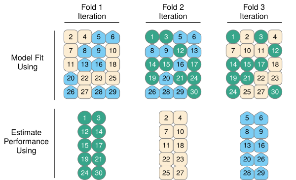
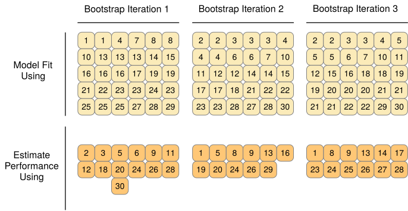
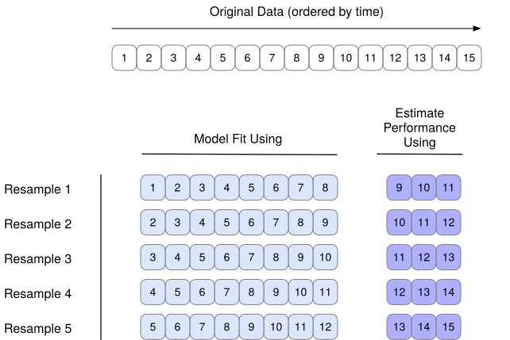

## Quick reminder: what we’re trying to estimate

We want the model’s performance on **new data**.

But we only have:

- one dataset
- one realized sample of “the world”
- finite size (and often class imbalance)

::: notes
AUC, RMSE, etc. are estimates. Resampling is how we get better estimates.
:::

---

## Why we care in finance

Model performance matters because decisions have costs:

- false positives vs false negatives (credit risk)
- asymmetric losses (risk management)
- stability matters (models used repeatedly)

::: notes
In finance: you care about both the level and the stability of performance.
:::

---

## A single train/test split is a roll of the dice

Even with the same dataset + same model:

- random split changes the training sample
- random split changes the test sample
- measured performance moves because of sampling noise
- the test set is a **final exam**: don’t use it for model selection or hyperparameter tuning

## Thought experiment

Two analysts do the same thing:

- Analyst A: AUC = 0.96
- Analyst B: AUC = 0.92

They both used the same code and model—just different splits.

So…which is “the true performance”?

---

## What resampling does (conceptually)

Resampling replaces:

> “one held-out set”

with

> “many plausible held-out sets”

Then:

- compute performance on each
- summarize as mean + spread

---

## Vocabulary check

- **Parameter**: learned from data (e.g., logistic regression coefficients)
- **Performance estimate**: computed from predictions (e.g., AUC on holdout)
- **Resampling**: repeated fitting/evaluation using structured re-use of the dataset

::: notes
We’ll use KNN + hyperparameters in Part 2. Here we stay evaluation-focused.
:::

---

## Resampling menu

- **Validation set approach** (single split)
- **LOOCV** (leave-one-out)
- **k-fold cross-validation**
- **bootstrap** (uncertainty / sampling with replacement)
- **rolling / expanding window** (time series; finance default)

::: notes
We’ll emphasize k-fold CV as the workhorse for i.i.d. data.
Rolling windows: the right default for forecasting problems.
:::

---

## The validation set approach {.smaller}

:::: columns
::: {.column width="50%"}

### What it is

- Split data into **train** and **test**
- Fit the model on **train**
- Evaluate on **test**
- You get **one** estimate of out-of-sample performance

::: notes
Say out loud: “This is what most people do first — and it’s fine as a first pass.”
:::

:::
::: {.column width="50%"}

### Why it’s used

- simplest conceptually
- fastest to run
- good for quick sanity checks

### Why it’s risky

- estimate depends on **which observations** land in test
- can be misleading for **rare events**
- not suitable for **model selection / hyperparameter tuning**
  (you’ll overfit the split)

::: notes
Key line: “Validation set approach is OK for a first check, but not a stable basis for choosing between models.”
:::

:::
::::

---

## What makes validation-set estimates noisy?

- smaller training set (less stable fit)
- smaller test set (less stable evaluation)
- for imbalanced outcomes: which rare cases land in test matters a lot

---

## Practical example: rare events

If the event is rare (defaults, fraud, churn):

- the test set might contain “not many” events
- metric values become sensitive to which events land in test
- repeated splits can vary surprisingly

::: notes
This is why accuracy is often a trap in rare-event settings.
:::

---

## LOOCV (Leave-One-Out CV) {.smaller}

How it works:

- hold out 1 observation
- train on the other $n-1$
- repeat $n$ times
- aggregate error / AUC / etc.

Why it’s appealing:

- uses almost all observations for training each time

Why it’s not always best:

- computational cost
- still can have high variance (depends on the problem)

---

## When LOOCV is most useful

LOOCV is often used when:

- $n$ is small
- model is fast to fit
- you want an “almost unbiased” training-size effect

In modern practice:

- k-fold is often the default anyway

---

## k-fold cross-validation (the workhorse)

How it works:

- split into $k$ folds
- repeat:
  - train on $k-1$ folds
  - validate on the held-out fold
- aggregate fold-wise performance

Typical choices:

- $k=5$ or $k=10$

---

## Visual: k-fold CV

{width=85%}

::: notes
Point out: there’s nothing special about *that* particular held-out block.
:::

---

## Visual: 3-fold CV

{width=90%}

::: notes
It’s 3 folds in the figure; in class we’ll use 10 folds.
:::

---

## Visual: CV iterations

{width=90%}

---

## Why do we like k-fold CV?

k-fold CV tends to be a good compromise:

- more stable than one split
- less computationally expensive than LOOCV
- works well for many model classes

---

## Choosing k: the intuition

- Smaller $k$ (e.g., 5):
  - bigger validation fold
  - fewer models to fit
  - sometimes slightly noisier, faster

- Larger $k$ (e.g., 10):
  - smaller validation fold
  - more models to fit
  - often a bit more stable

::: notes
Don’t oversell: 5 vs 10 usually doesn’t matter much compared to bigger modeling choices.
:::

---

## What CV produces (how to read it)

CV gives you a set of fold-wise scores:

- AUC$_1$, AUC$_2$, …, AUC$_k$

From that you can compute:

- mean CV AUC
- SD (spread across folds)
- SE (uncertainty in the mean, if you want it)

---

## What does “spread” mean?

If fold-wise scores vary a lot:

- the problem may be unstable / noisy
- your model may be overfitting
- performance might be sensitive to which observations you train on

If fold-wise scores are tight:

- performance is more stable
- you can trust comparisons more

---

## Train / CV / Test roles

:::: columns
::: {.column width="55%"}

### Big picture workflow

- **Training set**: fit parameters
- **CV (inside training)**: compare models, tune settings, choose features
- **Test set**: final evaluation (one-time, no iteration)

::: notes
Say “test set is the final exam” again.
:::

:::
::: {.column width="45%"}

### Inside each CV fold

- **analysis set**: the fold’s training data  
  (fit the model here)

- **assessment set**: the fold’s validation data  
  (score the model here)

::: notes
This is rsample vocabulary. It makes the fold mechanics concrete without teaching tidymodels.
:::

:::
::::

---

## Common mistake: test set leakage

If you:

- choose features based on test results
- tune hyperparameters based on test results
- choose threshold based on test results

…then your test performance is optimistic.

---

## Leakage: a concrete checklist

Leakage happens whenever information from validation/test influences training.

Common ways:

- preprocessing using full dataset (mean/SD, imputation, PCA)
- feature selection using full dataset
- tuning settings using the test set
- “peeking” at the test set repeatedly

---

## Paired comparisons (important in practice)

When comparing Model A vs Model B:

- use the **same folds**
- compute fold-wise differences
- summarize differences (mean diff + SD)

Why this helps:

- reduces noise from fold composition
- makes comparisons more fair

---

## Stratification (small but important)

For classification with imbalance:

- build folds that preserve class proportions
- many tools offer `strata = outcome`

Why it matters:

- prevents “event-free” folds
- reduces variance in fold-wise metrics

---

## Metrics choice matters

For rare events:

- accuracy can look great even for useless models
- AUC is often better for ranking
- threshold-based metrics depend on business objectives

::: notes
You already did ROC/AUC in Lecture 5; just connect to it.
:::

---

## Bootstrap resampling (quick but clearer)

Bootstrap:

- sample $n$ observations **with replacement**
- fit on bootstrap sample
- evaluate (often) on out-of-bag observations
- repeat many times

{width=88%}

::: notes
Bootstrap is heavily used for estimating uncertainty around parameters and predictions.
Different goal from CV (CV is often used for estimating test error / tuning).
:::

---

## CV vs bootstrap (how to remember)

- CV: “How good is the model out-of-sample?”
- Bootstrap: “How variable is this estimate / coefficient / prediction?”

(There is overlap, but that’s the mental model.)

---

## Time series caveat (finance)

For time series:

- random splits break temporal structure
- random folds leak future into past

Better evaluation:

- rolling window (fixed size)
- expanding window (grows over time)

{width=88%}

::: notes
Mention: you’ll revisit this for forecasting later; today we just flag it.
:::

---

## v-fold cross-validation with `rsample`

Goal: estimate performance more reliably than a single split

Key idea:

- create **many** train/validate splits (folds)
- fit on one part, evaluate on the held-out part
- summarize performance across folds

::: notes
This is “repeat the validation set idea many times in a structured way.”
:::

---

## `initial_split()` vs `vfold_cv()`

**Single split (validation set approach)**

- `initial_split(df, prop = 0.7)`
- then: `training(split)`, `testing(split)`

**v-fold CV**

- `vfold_cv(df, v = 10)`
- then: `analysis(split)`, `assessment(split)`

::: notes
Say: “Same concept—two pieces of data—but different names because it’s repeated many times.”
:::

---

## What `vfold_cv()` returns

`vfold_cv()` returns a tibble with:

- an `id` for each fold
- a `splits` column (each row contains one split object)

So you can think:

- **one row = one fold**
- **one split = analysis + assessment**

::: notes
It’s a tibble with a list-column. Don’t over-explain list-columns; just say “each row stores one fold.”
:::

---

## Inside each fold: analysis vs assessment

Within a given fold split:

- **analysis set**  
  “fit here” (like training data)

- **assessment set**  
  “score here” (like validation/test data)

Important:

- every observation appears in an assessment set exactly once (across all folds)

::: notes
This is the vocabulary that matches `rsample`.
:::

---

## Stratified v-fold CV (recommended for classification)

If your outcome is imbalanced (rare events), use stratification:

- `vfold_cv(df, v = 10, strata = outcome)`

Why:

- keeps class proportions similar in each fold
- reduces fold-to-fold weirdness (e.g., “almost no events in this fold”)

::: notes
This is exactly like `initial_split(..., strata=...)` but applied to folds.
:::

---

## The workflow you should follow

1. Create a final **train/test** split (test = final exam)
2. Create **v-fold CV** folds *inside training only*
3. Use folds to:
   - compare models
   - tune hyperparameters
   - choose features / preprocessing decisions
4. Evaluate once on the test set at the end

::: notes
Reinforce: CV is for selection; test is for final report.
:::

---

## What you compute from CV

From the folds you’ll get:

- fold-by-fold metric values (e.g., AUCs)
- mean CV performance
- spread across folds (SD)

Interpretation:

- mean = your best estimate
- spread = stability / uncertainty

::: notes
You can say: “This is why we like CV: you get both a number and a sense of how wobbly it is.”
:::

---

## Wrap-up (Part 1)

If you remember one thing:

- **One split is noisy**
- **CV gives a distribution, not a single number**
- Keep the **test set** for the final exam

Next (Part 2):

- KNN as a flexibility knob
- scaling + leakage (feature engineering toe dip)
- CV for tuning and comparison
